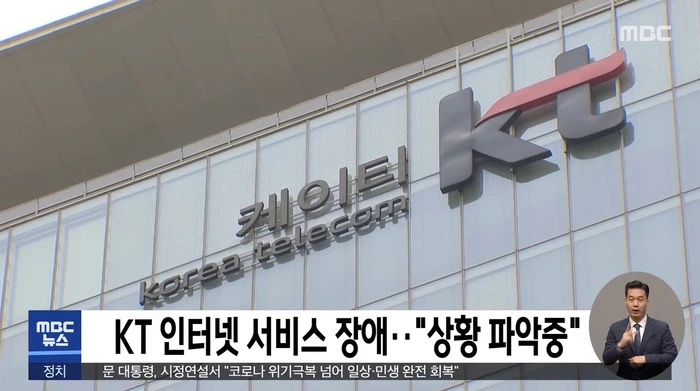
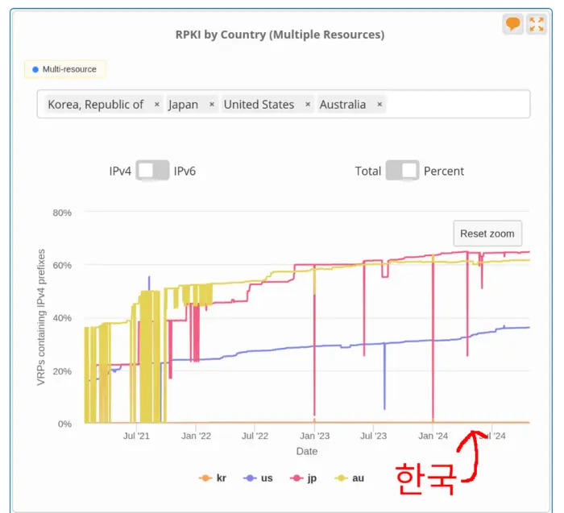

# 한국 인터넷 BGP 네트워크 RPKI 적용률 트래커
- 나무위키 [2021년 10월 KT 인터넷 장애 사건](https://namu.wiki/w/2021%EB%85%84%2010%EC%9B%94%20KT%20%EC%9D%B8%ED%84%B0%EB%84%B7%20%EC%9E%A5%EC%95%A0%20%EC%82%AC%EA%B1%B4)
- MTN 뉴스 [세계 표준되는 RPKI…우리나란 예산 '0원'](https://news.mtn.co.kr/news-detail/2024090813332917792)
- KISA [라우팅 인증(RPKI)](https://한국인터넷정보센터.한국/jsp/resources/rpki.jsp)

<a href="https://youtu.be/WGY_d4XFcjo">
MBC 보도: KT 인터넷 서비스 장애 "상황 파악중"


</a>




https://stat.ripe.net/ui2013/widget/rpki-by-country#w.resource=kr%2Cus%2Cjp%2Cau

RPKI가 BGP 설정 오류로 인한 장애 예방에 좋으면 빨리 적용해야겠죠? 각 사업자의
RPKI 적용률을 여기서 확인하세요.

UTC 기준 매주 월요일 자정에 업데이트 자동 업데이트 중([Github
Actions](https://github.com/dxdxdt/rpki-tracker-kr/actions)). 데이터는
`master`에 자동으로 커밋됨. 개발 편의를 위해 `dev`와 `stable` 브랜치에서는
데이터 파일이 트래킹되지 않음. 소스코드 수정은 해당 브랜치에서 진행, CD/CI에
적용 필요 시 `master`와 머지.

## 스크립트 실행 절차
[Makefile 레시피](Makefile) 설명.

1. KISA [AS번호 사용자
   현황](https://krnic.kisa.or.kr/jsp/business/management/asList.jsp) 페이지
   로드, 테이블 파싱
1. 파싱한 AS번호들 이용하여 [whois.radb.net](https://radb.net) 쿼리하여 라우팅 프리픽스
   정보 받아오기
1. 받아온 라우팅 프리픽스를 radb에 쿼리하여 `rpki-ov-state` 값이 `valid`인
   프리픽스만 추려냄
1. 데이터 취합 후 markdown테이블과 csv 파일 생성
1. READMD.md 생성, 테이블 삽입

## 프리픽스 현황
https://krnic.kisa.or.kr/jsp/business/management/asList.jsp

| 범례 | 설명 |
| - | - |
| ASN | 자율시스템 번호 |
| Name | 자율시스템 운영사 |
| RPKI | 유효한 ROA가 적용된 라우팅 프리픽스 개수 |
| Total | 총 라우팅 프리픽스 개수 |
| % | RPKI/Total 백분율 |
| Bars | 20점 만점 점수 |

AS는 [여러
종류](https://en.wikipedia.org/wiki/Autonomous_system_(Internet)#Types)가
있지만, [DFZ](https://en.wikipedia.org/wiki/Default-free_zone) 라우터에서 직접
네트워크 구조를 분석하지 않는 이상, RADB의 정보만으로는 어떤 AS가 ISP와 IX인지,
어떤 AS가 stub인지 알 수 없음. 이를 할 때 필요한 [LG
서버](https://en.wikipedia.org/wiki/Looking_Glass_server)가 한국에 많이 존재하지
않음. 하지만 인터넷 마비 예방은 ISP와 IX에서 운영되는 라우터에만 적용되어도
충분히 예방될 수 있음. 단순 CDN 애니케스트나, CPE, 데이터센터인 stub AS에서 RPKI
validation을 할 필요가 없기 때문에, 보급률이 100%가 될 필요는 없음. 이는 RIPE
지역의 보급률이 80%인 사실로 확인할 수 있음.

주의깊게 봐야할 AS들은 한국 기간망을 운영하는 통신 3사와 국내 IX임.

**업데이트: 2026-01-19T02:14:55.459256+00:00**

### IPv4
| ASN | Name | RPKI | Total | % | Bars |
|-|-|-:|-:|-:|-|
| AS6619 | 삼성에스디에스(주) | 1 | 9848 | 0.01% | ▒▒▒▒▒▒▒▒▒▒▒▒▒▒▒▒▒▒▒▒ |
| AS9689 | 에스케이브로드밴드주식회사 | 0 | 3683 | 0.00% | ▒▒▒▒▒▒▒▒▒▒▒▒▒▒▒▒▒▒▒▒ |
| AS9318 | 에스케이브로드밴드주식회사 | 86 | 2581 | 3.33% | ▒▒▒▒▒▒▒▒▒▒▒▒▒▒▒▒▒▒▒▒ |
| AS1237 | 한국과학기술정보연구원 | 2135 | 2257 | 94.59% | ██████████████████▒▒ |
| AS4766 | 주식회사 케이티 | 93 | 2022 | 4.60% | ▒▒▒▒▒▒▒▒▒▒▒▒▒▒▒▒▒▒▒▒ |
| AS17849 | 에스케이브로드밴드주식회사 | 0 | 1462 | 0.00% | ▒▒▒▒▒▒▒▒▒▒▒▒▒▒▒▒▒▒▒▒ |
| AS10036 | 주식회사 딜라이브 | 0 | 785 | 0.00% | ▒▒▒▒▒▒▒▒▒▒▒▒▒▒▒▒▒▒▒▒ |
| AS23577 | 주식회사 케이티 | 0 | 757 | 0.00% | ▒▒▒▒▒▒▒▒▒▒▒▒▒▒▒▒▒▒▒▒ |
| AS9848 | 세종네트웍스 주식회사 | 0 | 695 | 0.00% | ▒▒▒▒▒▒▒▒▒▒▒▒▒▒▒▒▒▒▒▒ |
| AS38103 | 에스케이브로드밴드주식회사 | 0 | 648 | 0.00% | ▒▒▒▒▒▒▒▒▒▒▒▒▒▒▒▒▒▒▒▒ |
| AS23563 | 에스케이브로드밴드주식회사 | 0 | 576 | 0.00% | ▒▒▒▒▒▒▒▒▒▒▒▒▒▒▒▒▒▒▒▒ |
| AS17857 | 에스케이브로드밴드주식회사 | 0 | 555 | 0.00% | ▒▒▒▒▒▒▒▒▒▒▒▒▒▒▒▒▒▒▒▒ |
| AS17841 | 국가정보자원관리원 | 0 | 549 | 0.00% | ▒▒▒▒▒▒▒▒▒▒▒▒▒▒▒▒▒▒▒▒ |
| AS3786 | (주)엘지유플러스 | 19 | 540 | 3.52% | ▒▒▒▒▒▒▒▒▒▒▒▒▒▒▒▒▒▒▒▒ |
| AS17864 | 에스케이브로드밴드주식회사 | 0 | 513 | 0.00% | ▒▒▒▒▒▒▒▒▒▒▒▒▒▒▒▒▒▒▒▒ |
| AS38091 | 주식회사 엘지헬로비전 | 0 | 465 | 0.00% | ▒▒▒▒▒▒▒▒▒▒▒▒▒▒▒▒▒▒▒▒ |
| AS45372 | 유엘네트웍스 | 0 | 458 | 0.00% | ▒▒▒▒▒▒▒▒▒▒▒▒▒▒▒▒▒▒▒▒ |
| AS17573 | 에스케이브로드밴드주식회사 | 0 | 442 | 0.00% | ▒▒▒▒▒▒▒▒▒▒▒▒▒▒▒▒▒▒▒▒ |
| AS9845 | 주식회사 엘지헬로비전 | 0 | 418 | 0.00% | ▒▒▒▒▒▒▒▒▒▒▒▒▒▒▒▒▒▒▒▒ |
| AS38097 | 에스케이브로드밴드주식회사 | 0 | 396 | 0.00% | ▒▒▒▒▒▒▒▒▒▒▒▒▒▒▒▒▒▒▒▒ |
| AS4668 | (주) 엘지씨엔에스 | 0 | 394 | 0.00% | ▒▒▒▒▒▒▒▒▒▒▒▒▒▒▒▒▒▒▒▒ |
| AS38661 | 에이비클 | 128 | 360 | 35.56% | ███████▒▒▒▒▒▒▒▒▒▒▒▒▒ |
| AS18310 | 에스케이브로드밴드주식회사 | 0 | 353 | 0.00% | ▒▒▒▒▒▒▒▒▒▒▒▒▒▒▒▒▒▒▒▒ |
| AS9770 | 주식회사 엘지헬로비전 | 1 | 349 | 0.29% | ▒▒▒▒▒▒▒▒▒▒▒▒▒▒▒▒▒▒▒▒ |
| AS18302 | 에스케이텔레콤(주) | 0 | 344 | 0.00% | ▒▒▒▒▒▒▒▒▒▒▒▒▒▒▒▒▒▒▒▒ |
| AS38095 | 에스케이브로드밴드주식회사 | 0 | 325 | 0.00% | ▒▒▒▒▒▒▒▒▒▒▒▒▒▒▒▒▒▒▒▒ |
| AS17597 | 에스케이브로드밴드주식회사 | 0 | 320 | 0.00% | ▒▒▒▒▒▒▒▒▒▒▒▒▒▒▒▒▒▒▒▒ |
| AS45974 | 엔에이치엔클라우드 | 0 | 316 | 0.00% | ▒▒▒▒▒▒▒▒▒▒▒▒▒▒▒▒▒▒▒▒ |
| AS9756 | 에스케이브로드밴드주식회사 | 0 | 298 | 0.00% | ▒▒▒▒▒▒▒▒▒▒▒▒▒▒▒▒▒▒▒▒ |
| AS23584 | 주식회사 케이티에이치씨엔 부산방송 | 0 | 290 | 0.00% | ▒▒▒▒▒▒▒▒▒▒▒▒▒▒▒▒▒▒▒▒ |
| AS45400 | 주식회사 케이티 | 0 | 285 | 0.00% | ▒▒▒▒▒▒▒▒▒▒▒▒▒▒▒▒▒▒▒▒ |
| AS18300 | 한국전력공사 | 0 | 276 | 0.00% | ▒▒▒▒▒▒▒▒▒▒▒▒▒▒▒▒▒▒▒▒ |
| AS9319 | 주식회사 케이티에이치씨엔 충북방송 | 0 | 261 | 0.00% | ▒▒▒▒▒▒▒▒▒▒▒▒▒▒▒▒▒▒▒▒ |
| AS23576 | 네이버클라우드 주식회사 | 0 | 249 | 0.00% | ▒▒▒▒▒▒▒▒▒▒▒▒▒▒▒▒▒▒▒▒ |
| AS38676 | (주)플렉스넷 | 0 | 242 | 0.00% | ▒▒▒▒▒▒▒▒▒▒▒▒▒▒▒▒▒▒▒▒ |
| AS38701 | 피란하시스템즈 | 0 | 236 | 0.00% | ▒▒▒▒▒▒▒▒▒▒▒▒▒▒▒▒▒▒▒▒ |
| AS38669 | 주식회사 엘지헬로비전 | 0 | 210 | 0.00% | ▒▒▒▒▒▒▒▒▒▒▒▒▒▒▒▒▒▒▒▒ |
| AS17854 | 에스케이브로드밴드주식회사 | 0 | 209 | 0.00% | ▒▒▒▒▒▒▒▒▒▒▒▒▒▒▒▒▒▒▒▒ |
| AS10066 | 주식회사 엘지헬로비전 | 0 | 206 | 0.00% | ▒▒▒▒▒▒▒▒▒▒▒▒▒▒▒▒▒▒▒▒ |
| AS10164 | 에스케이브로드밴드주식회사 | 0 | 204 | 0.00% | ▒▒▒▒▒▒▒▒▒▒▒▒▒▒▒▒▒▒▒▒ |
| AS17871 | 에스케이브로드밴드주식회사 | 0 | 203 | 0.00% | ▒▒▒▒▒▒▒▒▒▒▒▒▒▒▒▒▒▒▒▒ |
| AS45996 | (주)다우기술 | 6 | 201 | 2.99% | ▒▒▒▒▒▒▒▒▒▒▒▒▒▒▒▒▒▒▒▒ |
| AS10158 | 주식회사 카카오 | 0 | 199 | 0.00% | ▒▒▒▒▒▒▒▒▒▒▒▒▒▒▒▒▒▒▒▒ |
| AS9952 | 호스트웨이아이디씨(주) | 0 | 186 | 0.00% | ▒▒▒▒▒▒▒▒▒▒▒▒▒▒▒▒▒▒▒▒ |
| AS38096 | 에스케이브로드밴드주식회사 | 0 | 176 | 0.00% | ▒▒▒▒▒▒▒▒▒▒▒▒▒▒▒▒▒▒▒▒ |
| AS18305 | (주)포스코디엑스 | 22 | 166 | 13.25% | ██▒▒▒▒▒▒▒▒▒▒▒▒▒▒▒▒▒▒ |
| AS9697 | 주식회사 엘지헬로비전 | 0 | 165 | 0.00% | ▒▒▒▒▒▒▒▒▒▒▒▒▒▒▒▒▒▒▒▒ |
| AS9971 | 에스케이브로드밴드주식회사 | 0 | 158 | 0.00% | ▒▒▒▒▒▒▒▒▒▒▒▒▒▒▒▒▒▒▒▒ |
| AS17839 | 주식회사 엘지헬로비전 | 0 | 157 | 0.00% | ▒▒▒▒▒▒▒▒▒▒▒▒▒▒▒▒▒▒▒▒ |
| AS9457 | 드림라인(주) | 65 | 156 | 41.67% | ████████▒▒▒▒▒▒▒▒▒▒▒▒ |
| AS9762 | 주식회사 케이티에이치씨엔 | 0 | 152 | 0.00% | ▒▒▒▒▒▒▒▒▒▒▒▒▒▒▒▒▒▒▒▒ |
| AS9286 | 주식회사 케이아이엔엑스 | 1 | 149 | 0.67% | ▒▒▒▒▒▒▒▒▒▒▒▒▒▒▒▒▒▒▒▒ |
| AS17583 | 금강방송주식회사 | 0 | 148 | 0.00% | ▒▒▒▒▒▒▒▒▒▒▒▒▒▒▒▒▒▒▒▒ |
| AS7562 | 주식회사 케이티에이치씨엔 동작방송 | 2 | 136 | 1.47% | ▒▒▒▒▒▒▒▒▒▒▒▒▒▒▒▒▒▒▒▒ |
| AS9943 | (주)딜라이브강남케이블티브이 | 0 | 135 | 0.00% | ▒▒▒▒▒▒▒▒▒▒▒▒▒▒▒▒▒▒▒▒ |
| AS17608 | 주식회사 아름방송네트워크 | 0 | 134 | 0.00% | ▒▒▒▒▒▒▒▒▒▒▒▒▒▒▒▒▒▒▒▒ |
| AS9950 | (주)엘지유플러스 | 0 | 133 | 0.00% | ▒▒▒▒▒▒▒▒▒▒▒▒▒▒▒▒▒▒▒▒ |
| AS9946 | (주)KCTV제주방송 | 0 | 129 | 0.00% | ▒▒▒▒▒▒▒▒▒▒▒▒▒▒▒▒▒▒▒▒ |
| AS131866 | 디지털엣지코리아 | 0 | 126 | 0.00% | ▒▒▒▒▒▒▒▒▒▒▒▒▒▒▒▒▒▒▒▒ |
| AS10054 | 주식회사 씨엠비광주방송 | 0 | 117 | 0.00% | ▒▒▒▒▒▒▒▒▒▒▒▒▒▒▒▒▒▒▒▒ |
| AS38121 | 주식회사 엘지헬로비전 | 0 | 117 | 0.00% | ▒▒▒▒▒▒▒▒▒▒▒▒▒▒▒▒▒▒▒▒ |
| AS4961 | 메타넷디지털 주식회사 | 0 | 116 | 0.00% | ▒▒▒▒▒▒▒▒▒▒▒▒▒▒▒▒▒▒▒▒ |
| AS9957 | 주식회사 케이아이엔엑스 | 0 | 114 | 0.00% | ▒▒▒▒▒▒▒▒▒▒▒▒▒▒▒▒▒▒▒▒ |
| AS38107 | 씨디네트웍스 | 1 | 113 | 0.88% | ▒▒▒▒▒▒▒▒▒▒▒▒▒▒▒▒▒▒▒▒ |
| AS9459 | 건국대학교 | 0 | 110 | 0.00% | ▒▒▒▒▒▒▒▒▒▒▒▒▒▒▒▒▒▒▒▒ |
| AS55615 | 더존비즈온 | 0 | 110 | 0.00% | ▒▒▒▒▒▒▒▒▒▒▒▒▒▒▒▒▒▒▒▒ |
| AS38390 | 경기도고양교육지원청 | 0 | 109 | 0.00% | ▒▒▒▒▒▒▒▒▒▒▒▒▒▒▒▒▒▒▒▒ |
| AS9644 | 에스케이텔레콤(주) | 0 | 108 | 0.00% | ▒▒▒▒▒▒▒▒▒▒▒▒▒▒▒▒▒▒▒▒ |
| AS10154 | 두나무 주식회사 | 0 | 108 | 0.00% | ▒▒▒▒▒▒▒▒▒▒▒▒▒▒▒▒▒▒▒▒ |
| AS9323 | 동국대학교 | 0 | 107 | 0.00% | ▒▒▒▒▒▒▒▒▒▒▒▒▒▒▒▒▒▒▒▒ |
| AS38402 | 경기도수원교육지원청 | 0 | 107 | 0.00% | ▒▒▒▒▒▒▒▒▒▒▒▒▒▒▒▒▒▒▒▒ |
| AS17589 | (주)가비아 | 0 | 105 | 0.00% | ▒▒▒▒▒▒▒▒▒▒▒▒▒▒▒▒▒▒▒▒ |
| AS9524 | 현대오토에버 주식회사 | 0 | 104 | 0.00% | ▒▒▒▒▒▒▒▒▒▒▒▒▒▒▒▒▒▒▒▒ |
| AS9569 | 주식회사 케이티에이치씨엔 서초방송 | 0 | 104 | 0.00% | ▒▒▒▒▒▒▒▒▒▒▒▒▒▒▒▒▒▒▒▒ |
| AS38120 | 주식회사 엘지헬로비전 | 0 | 104 | 0.00% | ▒▒▒▒▒▒▒▒▒▒▒▒▒▒▒▒▒▒▒▒ |
| AS9981 | 주식회사 케이티에이치씨엔 새로넷방송 | 0 | 102 | 0.00% | ▒▒▒▒▒▒▒▒▒▒▒▒▒▒▒▒▒▒▒▒ |
| AS7623 | 주식회사 케이티에이치씨엔 경북방송 | 0 | 100 | 0.00% | ▒▒▒▒▒▒▒▒▒▒▒▒▒▒▒▒▒▒▒▒ |
| AS10171 | 에스케이텔링크주식회사 | 0 | 99 | 0.00% | ▒▒▒▒▒▒▒▒▒▒▒▒▒▒▒▒▒▒▒▒ |
| AS10068 | 아이링크코리아(주) | 0 | 94 | 0.00% | ▒▒▒▒▒▒▒▒▒▒▒▒▒▒▒▒▒▒▒▒ |
| AS17598 | 주식회사 엘지헬로비전 | 0 | 94 | 0.00% | ▒▒▒▒▒▒▒▒▒▒▒▒▒▒▒▒▒▒▒▒ |
| AS17858 | (주)엘지유플러스 | 0 | 93 | 0.00% | ▒▒▒▒▒▒▒▒▒▒▒▒▒▒▒▒▒▒▒▒ |
| AS55592 | (주)한국데이터통신 | 0 | 88 | 0.00% | ▒▒▒▒▒▒▒▒▒▒▒▒▒▒▒▒▒▒▒▒ |
| AS10037 | 유진투자선물 | 0 | 88 | 0.00% | ▒▒▒▒▒▒▒▒▒▒▒▒▒▒▒▒▒▒▒▒ |
| AS9761 | 아시아나IDT(주) | 0 | 87 | 0.00% | ▒▒▒▒▒▒▒▒▒▒▒▒▒▒▒▒▒▒▒▒ |
| AS17586 | 주식회사 엘지헬로비전 | 0 | 87 | 0.00% | ▒▒▒▒▒▒▒▒▒▒▒▒▒▒▒▒▒▒▒▒ |
| AS38394 | 경기도성남교육지원청 | 0 | 86 | 0.00% | ▒▒▒▒▒▒▒▒▒▒▒▒▒▒▒▒▒▒▒▒ |
| AS38680 | 주식회사 씨엠비영등포방송 | 0 | 86 | 0.00% | ▒▒▒▒▒▒▒▒▒▒▒▒▒▒▒▒▒▒▒▒ |
| AS9530 | (주)신세계아이앤씨 | 0 | 85 | 0.00% | ▒▒▒▒▒▒▒▒▒▒▒▒▒▒▒▒▒▒▒▒ |
| AS45370 | 브로드밴드아이디씨 | 0 | 85 | 0.00% | ▒▒▒▒▒▒▒▒▒▒▒▒▒▒▒▒▒▒▒▒ |
| AS38411 | 경기도용인교육지원청 | 0 | 82 | 0.00% | ▒▒▒▒▒▒▒▒▒▒▒▒▒▒▒▒▒▒▒▒ |
| AS38404 | 경기도부천교육지원청 | 0 | 79 | 0.00% | ▒▒▒▒▒▒▒▒▒▒▒▒▒▒▒▒▒▒▒▒ |
| AS9698 | 주식회사 엘지헬로비전 | 0 | 78 | 0.00% | ▒▒▒▒▒▒▒▒▒▒▒▒▒▒▒▒▒▒▒▒ |
| AS38406 | 경기도화성오산교육지원청 | 0 | 78 | 0.00% | ▒▒▒▒▒▒▒▒▒▒▒▒▒▒▒▒▒▒▒▒ |
| AS23578 | 에스케이브로드밴드주식회사 | 0 | 77 | 0.00% | ▒▒▒▒▒▒▒▒▒▒▒▒▒▒▒▒▒▒▒▒ |
| AS55618 | 울산대학교 | 0 | 76 | 0.00% | ▒▒▒▒▒▒▒▒▒▒▒▒▒▒▒▒▒▒▒▒ |
| AS23570 | 국립대학법인 인천대학교 | 0 | 75 | 0.00% | ▒▒▒▒▒▒▒▒▒▒▒▒▒▒▒▒▒▒▒▒ |
| AS9694 | 주식회사 서경방송 | 0 | 74 | 0.00% | ▒▒▒▒▒▒▒▒▒▒▒▒▒▒▒▒▒▒▒▒ |
| AS45361 | JCN울산중앙방송(주) | 0 | 74 | 0.00% | ▒▒▒▒▒▒▒▒▒▒▒▒▒▒▒▒▒▒▒▒ |
| AS38415 | 경기도구리남양주교육지원청 | 0 | 72 | 0.00% | ▒▒▒▒▒▒▒▒▒▒▒▒▒▒▒▒▒▒▒▒ |
| AS17859 | 나이스평가정보주식회사 | 0 | 72 | 0.00% | ▒▒▒▒▒▒▒▒▒▒▒▒▒▒▒▒▒▒▒▒ |
| AS18313 | 주식회사 엘지헬로비전 | 0 | 71 | 0.00% | ▒▒▒▒▒▒▒▒▒▒▒▒▒▒▒▒▒▒▒▒ |
| AS9578 | 씨제이올리브네트웍스 주식회사 | 0 | 70 | 0.00% | ▒▒▒▒▒▒▒▒▒▒▒▒▒▒▒▒▒▒▒▒ |
| AS9647 | 서울특별시청 | 0 | 70 | 0.00% | ▒▒▒▒▒▒▒▒▒▒▒▒▒▒▒▒▒▒▒▒ |
| AS9980 | 롯데이노베이트 주식회사 | 0 | 70 | 0.00% | ▒▒▒▒▒▒▒▒▒▒▒▒▒▒▒▒▒▒▒▒ |
| AS17577 | 주식회사 엘지헬로비전 | 0 | 68 | 0.00% | ▒▒▒▒▒▒▒▒▒▒▒▒▒▒▒▒▒▒▒▒ |
| AS9757 | (주)씨엠비동대문방송 | 0 | 67 | 0.00% | ▒▒▒▒▒▒▒▒▒▒▒▒▒▒▒▒▒▒▒▒ |
| AS38396 | 경기도파주교육지원청 | 0 | 67 | 0.00% | ▒▒▒▒▒▒▒▒▒▒▒▒▒▒▒▒▒▒▒▒ |
| AS38109 | 에스케이브로드밴드주식회사 | 0 | 67 | 0.00% | ▒▒▒▒▒▒▒▒▒▒▒▒▒▒▒▒▒▒▒▒ |
| AS38099 | 주식회사 카카오 | 0 | 66 | 0.00% | ▒▒▒▒▒▒▒▒▒▒▒▒▒▒▒▒▒▒▒▒ |
| AS10155 | 중소벤처기업진흥공단 | 0 | 66 | 0.00% | ▒▒▒▒▒▒▒▒▒▒▒▒▒▒▒▒▒▒▒▒ |
| AS9781 | 한국케이블TV푸른방송(주) | 0 | 64 | 0.00% | ▒▒▒▒▒▒▒▒▒▒▒▒▒▒▒▒▒▒▒▒ |
| AS17574 | 서울특별시데이터센터 | 0 | 63 | 0.00% | ▒▒▒▒▒▒▒▒▒▒▒▒▒▒▒▒▒▒▒▒ |
| AS10175 | 주식회사 케이티에이치씨엔 금호방송 | 0 | 63 | 0.00% | ▒▒▒▒▒▒▒▒▒▒▒▒▒▒▒▒▒▒▒▒ |
| AS17569 | (주)전국24시콜화물 | 0 | 63 | 0.00% | ▒▒▒▒▒▒▒▒▒▒▒▒▒▒▒▒▒▒▒▒ |
| AS17878 | 드림마크원주식회사 | 4 | 63 | 6.35% | █▒▒▒▒▒▒▒▒▒▒▒▒▒▒▒▒▒▒▒ |
| AS9853 | 주식회사 지오레이넷 | 0 | 62 | 0.00% | ▒▒▒▒▒▒▒▒▒▒▒▒▒▒▒▒▒▒▒▒ |
| AS38684 | (주) 씨엠비 | 0 | 62 | 0.00% | ▒▒▒▒▒▒▒▒▒▒▒▒▒▒▒▒▒▒▒▒ |
| AS45385 | (주)대림 | 0 | 62 | 0.00% | ▒▒▒▒▒▒▒▒▒▒▒▒▒▒▒▒▒▒▒▒ |
| AS45975 | 삼성에스디에스(주) | 0 | 62 | 0.00% | ▒▒▒▒▒▒▒▒▒▒▒▒▒▒▒▒▒▒▒▒ |
| AS38400 | 경기도평택교육지원청 | 0 | 61 | 0.00% | ▒▒▒▒▒▒▒▒▒▒▒▒▒▒▒▒▒▒▒▒ |
| AS10191 | 재단법인 씨젠의료재단 | 0 | 61 | 0.00% | ▒▒▒▒▒▒▒▒▒▒▒▒▒▒▒▒▒▒▒▒ |
| AS38398 | 경기도의정부교육지원청 | 0 | 60 | 0.00% | ▒▒▒▒▒▒▒▒▒▒▒▒▒▒▒▒▒▒▒▒ |
| AS38407 | 경기도안산교육지원청 | 0 | 60 | 0.00% | ▒▒▒▒▒▒▒▒▒▒▒▒▒▒▒▒▒▒▒▒ |
| AS4040 | 주식회사 케이티 | 0 | 59 | 0.00% | ▒▒▒▒▒▒▒▒▒▒▒▒▒▒▒▒▒▒▒▒ |
| AS38409 | 경기도동두천양주교육지원청 | 0 | 58 | 0.00% | ▒▒▒▒▒▒▒▒▒▒▒▒▒▒▒▒▒▒▒▒ |
| AS9526 | 주식회사 코스콤 | 0 | 57 | 0.00% | ▒▒▒▒▒▒▒▒▒▒▒▒▒▒▒▒▒▒▒▒ |
| AS38408 | 경기도안양과천교육지원청 | 0 | 56 | 0.00% | ▒▒▒▒▒▒▒▒▒▒▒▒▒▒▒▒▒▒▒▒ |
| AS9708 | 부경대학교 | 0 | 55 | 0.00% | ▒▒▒▒▒▒▒▒▒▒▒▒▒▒▒▒▒▒▒▒ |
| AS7557 | (주)한국무역정보통신 | 0 | 55 | 0.00% | ▒▒▒▒▒▒▒▒▒▒▒▒▒▒▒▒▒▒▒▒ |
| AS38410 | 경기도포천교육지원청 | 0 | 55 | 0.00% | ▒▒▒▒▒▒▒▒▒▒▒▒▒▒▒▒▒▒▒▒ |
| AS9277 | 에스케이브로드밴드주식회사 | 0 | 53 | 0.00% | ▒▒▒▒▒▒▒▒▒▒▒▒▒▒▒▒▒▒▒▒ |
| AS17596 | 파인에셋서비스 주식회사 | 0 | 53 | 0.00% | ▒▒▒▒▒▒▒▒▒▒▒▒▒▒▒▒▒▒▒▒ |
| AS4671 | 한국통신사업자연합회 | 0 | 53 | 0.00% | ▒▒▒▒▒▒▒▒▒▒▒▒▒▒▒▒▒▒▒▒ |
| AS9767 | 주식회사 디비아이엔씨 | 0 | 52 | 0.00% | ▒▒▒▒▒▒▒▒▒▒▒▒▒▒▒▒▒▒▒▒ |
| AS17594 | 서울외국환중개주식회사 | 0 | 52 | 0.00% | ▒▒▒▒▒▒▒▒▒▒▒▒▒▒▒▒▒▒▒▒ |
| AS10160 | 케이디디아이코리아(주) | 40 | 51 | 78.43% | ███████████████▒▒▒▒▒ |
| AS9842 | 롯데이노베이트 주식회사 | 0 | 50 | 0.00% | ▒▒▒▒▒▒▒▒▒▒▒▒▒▒▒▒▒▒▒▒ |
| AS45365 | 주식회사 엘지헬로비전 | 0 | 49 | 0.00% | ▒▒▒▒▒▒▒▒▒▒▒▒▒▒▒▒▒▒▒▒ |
| AS18318 | 주식회사 엘지헬로비전 | 0 | 48 | 0.00% | ▒▒▒▒▒▒▒▒▒▒▒▒▒▒▒▒▒▒▒▒ |
| AS45985 | 삼성에스디에스(주) | 0 | 48 | 0.00% | ▒▒▒▒▒▒▒▒▒▒▒▒▒▒▒▒▒▒▒▒ |
| AS9964 | 주식회사 케이티 | 0 | 47 | 0.00% | ▒▒▒▒▒▒▒▒▒▒▒▒▒▒▒▒▒▒▒▒ |
| AS38133 | (주)씨엠비충청방송 | 0 | 46 | 0.00% | ▒▒▒▒▒▒▒▒▒▒▒▒▒▒▒▒▒▒▒▒ |
| AS38391 | 경기도김포교육지원청 | 0 | 46 | 0.00% | ▒▒▒▒▒▒▒▒▒▒▒▒▒▒▒▒▒▒▒▒ |
| AS7564 | 한국원자력연구원 | 0 | 45 | 0.00% | ▒▒▒▒▒▒▒▒▒▒▒▒▒▒▒▒▒▒▒▒ |
| AS38395 | 경기도광주하남교육지원청 | 0 | 45 | 0.00% | ▒▒▒▒▒▒▒▒▒▒▒▒▒▒▒▒▒▒▒▒ |
| AS45374 | 주식회사 씨씨에스충북방송 | 0 | 45 | 0.00% | ▒▒▒▒▒▒▒▒▒▒▒▒▒▒▒▒▒▒▒▒ |
| AS9858 | 한국인터넷진흥원 | 0 | 45 | 0.00% | ▒▒▒▒▒▒▒▒▒▒▒▒▒▒▒▒▒▒▒▒ |
| AS18157 | 오에스비저축은행 | 0 | 45 | 0.00% | ▒▒▒▒▒▒▒▒▒▒▒▒▒▒▒▒▒▒▒▒ |
| AS9452 | 고려대학교 | 0 | 44 | 0.00% | ▒▒▒▒▒▒▒▒▒▒▒▒▒▒▒▒▒▒▒▒ |
| AS55609 | 사단법인 금융보안원 | 0 | 44 | 0.00% | ▒▒▒▒▒▒▒▒▒▒▒▒▒▒▒▒▒▒▒▒ |
| AS9638 | 농협중앙회유통전산센터 | 0 | 43 | 0.00% | ▒▒▒▒▒▒▒▒▒▒▒▒▒▒▒▒▒▒▒▒ |
| AS10049 | SK(주) | 4 | 43 | 9.30% | █▒▒▒▒▒▒▒▒▒▒▒▒▒▒▒▒▒▒▒ |
| AS38403 | 경기도군포의왕교육지원청 | 0 | 43 | 0.00% | ▒▒▒▒▒▒▒▒▒▒▒▒▒▒▒▒▒▒▒▒ |
| AS38697 | 한경국립대학교 | 0 | 43 | 0.00% | ▒▒▒▒▒▒▒▒▒▒▒▒▒▒▒▒▒▒▒▒ |
| AS18023 | 국립한국해양대학교 | 0 | 42 | 0.00% | ▒▒▒▒▒▒▒▒▒▒▒▒▒▒▒▒▒▒▒▒ |
| AS38412 | 경기도이천교육지원청 | 0 | 42 | 0.00% | ▒▒▒▒▒▒▒▒▒▒▒▒▒▒▒▒▒▒▒▒ |
| AS38424 | 한국케이블텔레콤 | 0 | 42 | 0.00% | ▒▒▒▒▒▒▒▒▒▒▒▒▒▒▒▒▒▒▒▒ |
| AS10186 | 대한적십자사 혈액관리본부 | 0 | 42 | 0.00% | ▒▒▒▒▒▒▒▒▒▒▒▒▒▒▒▒▒▒▒▒ |
| AS45363 | 선문대학교 | 0 | 41 | 0.00% | ▒▒▒▒▒▒▒▒▒▒▒▒▒▒▒▒▒▒▒▒ |
| AS38388 | (재)한국저작권보호원 | 0 | 41 | 0.00% | ▒▒▒▒▒▒▒▒▒▒▒▒▒▒▒▒▒▒▒▒ |
| AS38399 | 경기도여주교육지원청 | 0 | 40 | 0.00% | ▒▒▒▒▒▒▒▒▒▒▒▒▒▒▒▒▒▒▒▒ |
| AS38401 | 경기도안성교육지원청 | 0 | 40 | 0.00% | ▒▒▒▒▒▒▒▒▒▒▒▒▒▒▒▒▒▒▒▒ |
| AS17581 | 미래에셋증권 주식회사 | 0 | 40 | 0.00% | ▒▒▒▒▒▒▒▒▒▒▒▒▒▒▒▒▒▒▒▒ |
| AS23588 | (주)카카오 엔터프라이즈 | 0 | 40 | 0.00% | ▒▒▒▒▒▒▒▒▒▒▒▒▒▒▒▒▒▒▒▒ |
| AS7625 | 주식회사 카카오 | 0 | 39 | 0.00% | ▒▒▒▒▒▒▒▒▒▒▒▒▒▒▒▒▒▒▒▒ |
| AS38414 | 경기도시흥교육지원청 | 0 | 39 | 0.00% | ▒▒▒▒▒▒▒▒▒▒▒▒▒▒▒▒▒▒▒▒ |
| AS45382 | 호스트센터(주) | 1 | 39 | 2.56% | ▒▒▒▒▒▒▒▒▒▒▒▒▒▒▒▒▒▒▒▒ |
| AS9701 | (주)비아웹 | 0 | 39 | 0.00% | ▒▒▒▒▒▒▒▒▒▒▒▒▒▒▒▒▒▒▒▒ |
| AS17837 | 엔에이치엔케이씨피 주식회사 | 0 | 38 | 0.00% | ▒▒▒▒▒▒▒▒▒▒▒▒▒▒▒▒▒▒▒▒ |
| AS23908 | 인천국제공항공사 | 0 | 38 | 0.00% | ▒▒▒▒▒▒▒▒▒▒▒▒▒▒▒▒▒▒▒▒ |
| AS18401 | 대구대학교 | 0 | 38 | 0.00% | ▒▒▒▒▒▒▒▒▒▒▒▒▒▒▒▒▒▒▒▒ |
| AS18033 | (주)씨엠비대구방송 | 0 | 38 | 0.00% | ▒▒▒▒▒▒▒▒▒▒▒▒▒▒▒▒▒▒▒▒ |
| AS38660 | 한국수력원자력(주) | 0 | 38 | 0.00% | ▒▒▒▒▒▒▒▒▒▒▒▒▒▒▒▒▒▒▒▒ |
| AS38387 | (주)씨엠비세종방송 | 0 | 38 | 0.00% | ▒▒▒▒▒▒▒▒▒▒▒▒▒▒▒▒▒▒▒▒ |
| AS38679 | 한국결제네트웍스 유한회사 | 0 | 38 | 0.00% | ▒▒▒▒▒▒▒▒▒▒▒▒▒▒▒▒▒▒▒▒ |
| AS38393 | 홈플러스 주식회사 | 1 | 38 | 2.63% | ▒▒▒▒▒▒▒▒▒▒▒▒▒▒▒▒▒▒▒▒ |
| AS9636 | 엔에이치엔페이코 | 0 | 38 | 0.00% | ▒▒▒▒▒▒▒▒▒▒▒▒▒▒▒▒▒▒▒▒ |
| AS9494 | 한국지능정보사회진흥원 | 0 | 37 | 0.00% | ▒▒▒▒▒▒▒▒▒▒▒▒▒▒▒▒▒▒▒▒ |
| AS4792 | 네이트커뮤니케이션즈 주식회사 | 0 | 37 | 0.00% | ▒▒▒▒▒▒▒▒▒▒▒▒▒▒▒▒▒▒▒▒ |
| AS18028 | 경상국립대학교 | 0 | 37 | 0.00% | ▒▒▒▒▒▒▒▒▒▒▒▒▒▒▒▒▒▒▒▒ |
| AS55628 | 인천광역시경제자유구역청(인천글로벌캠퍼스) | 0 | 37 | 0.00% | ▒▒▒▒▒▒▒▒▒▒▒▒▒▒▒▒▒▒▒▒ |
| AS18311 | 씨엔씨티에너지 주식회사 | 0 | 37 | 0.00% | ▒▒▒▒▒▒▒▒▒▒▒▒▒▒▒▒▒▒▒▒ |
| AS9455 | (재)한국교육학술정보원 | 0 | 35 | 0.00% | ▒▒▒▒▒▒▒▒▒▒▒▒▒▒▒▒▒▒▒▒ |
| AS17862 | 강원대학교 | 0 | 35 | 0.00% | ▒▒▒▒▒▒▒▒▒▒▒▒▒▒▒▒▒▒▒▒ |
| AS23552 | 나사렛대학교 | 0 | 35 | 0.00% | ▒▒▒▒▒▒▒▒▒▒▒▒▒▒▒▒▒▒▒▒ |
| AS4665 | 연세대학교 | 0 | 35 | 0.00% | ▒▒▒▒▒▒▒▒▒▒▒▒▒▒▒▒▒▒▒▒ |
| AS18328 | 주식회사 닷네임코리아 | 19 | 35 | 54.29% | ██████████▒▒▒▒▒▒▒▒▒▒ |
| AS38405 | 경기도광명교육지원청 | 0 | 35 | 0.00% | ▒▒▒▒▒▒▒▒▒▒▒▒▒▒▒▒▒▒▒▒ |
| AS4793 | 에이치디현대중공업 주식회사 | 0 | 35 | 0.00% | ▒▒▒▒▒▒▒▒▒▒▒▒▒▒▒▒▒▒▒▒ |
| AS9764 | 주식회사 카카오 | 0 | 35 | 0.00% | ▒▒▒▒▒▒▒▒▒▒▒▒▒▒▒▒▒▒▒▒ |
| AS3357 | 주식회사 브이랜24 | 0 | 35 | 0.00% | ▒▒▒▒▒▒▒▒▒▒▒▒▒▒▒▒▒▒▒▒ |
| AS9568 | 한국기계연구원 | 0 | 35 | 0.00% | ▒▒▒▒▒▒▒▒▒▒▒▒▒▒▒▒▒▒▒▒ |
| AS9712 | 주식회사 아이네트 | 2 | 34 | 5.88% | █▒▒▒▒▒▒▒▒▒▒▒▒▒▒▒▒▒▒▒ |
| AS17856 | 건양대학교 | 0 | 34 | 0.00% | ▒▒▒▒▒▒▒▒▒▒▒▒▒▒▒▒▒▒▒▒ |
| AS38392 | 경기도양평교육지원청 | 0 | 34 | 0.00% | ▒▒▒▒▒▒▒▒▒▒▒▒▒▒▒▒▒▒▒▒ |
| AS45399 | 한진정보통신(주) | 0 | 34 | 0.00% | ▒▒▒▒▒▒▒▒▒▒▒▒▒▒▒▒▒▒▒▒ |
| AS38426 | 재단법인 한국농촌경제연구원 | 0 | 34 | 0.00% | ▒▒▒▒▒▒▒▒▒▒▒▒▒▒▒▒▒▒▒▒ |
| AS17606 | 에스엠상선 주식회사 | 0 | 34 | 0.00% | ▒▒▒▒▒▒▒▒▒▒▒▒▒▒▒▒▒▒▒▒ |
| AS9637 | 한국기초과학지원연구원 | 0 | 34 | 0.00% | ▒▒▒▒▒▒▒▒▒▒▒▒▒▒▒▒▒▒▒▒ |
| AS7560 | 전북대학교 | 0 | 33 | 0.00% | ▒▒▒▒▒▒▒▒▒▒▒▒▒▒▒▒▒▒▒▒ |
| AS9686 | 성균관대학교 | 0 | 32 | 0.00% | ▒▒▒▒▒▒▒▒▒▒▒▒▒▒▒▒▒▒▒▒ |
| AS9782 | 우송대학교 | 0 | 32 | 0.00% | ▒▒▒▒▒▒▒▒▒▒▒▒▒▒▒▒▒▒▒▒ |
| AS4663 | 주식회사 엘림넷 | 0 | 32 | 0.00% | ▒▒▒▒▒▒▒▒▒▒▒▒▒▒▒▒▒▒▒▒ |
| AS38413 | 경기도평생교육진흥원 | 0 | 32 | 0.00% | ▒▒▒▒▒▒▒▒▒▒▒▒▒▒▒▒▒▒▒▒ |
| AS9321 | 한양대학교 | 0 | 31 | 0.00% | ▒▒▒▒▒▒▒▒▒▒▒▒▒▒▒▒▒▒▒▒ |
| AS23982 | 네이버클라우드 주식회사 | 0 | 31 | 0.00% | ▒▒▒▒▒▒▒▒▒▒▒▒▒▒▒▒▒▒▒▒ |
| AS9868 | 대구가톨릭대학교 | 0 | 30 | 0.00% | ▒▒▒▒▒▒▒▒▒▒▒▒▒▒▒▒▒▒▒▒ |
| AS9978 | 서울시립대학교 | 0 | 30 | 0.00% | ▒▒▒▒▒▒▒▒▒▒▒▒▒▒▒▒▒▒▒▒ |
| AS17575 | 중앙대학교 | 0 | 30 | 0.00% | ▒▒▒▒▒▒▒▒▒▒▒▒▒▒▒▒▒▒▒▒ |
| AS9316 | (주)엘지유플러스 | 0 | 30 | 0.00% | ▒▒▒▒▒▒▒▒▒▒▒▒▒▒▒▒▒▒▒▒ |
| AS9973 | 주식회사 비에스아이티씨 | 0 | 30 | 0.00% | ▒▒▒▒▒▒▒▒▒▒▒▒▒▒▒▒▒▒▒▒ |
| AS17844 | 국민연금공단(본점) | 0 | 30 | 0.00% | ▒▒▒▒▒▒▒▒▒▒▒▒▒▒▒▒▒▒▒▒ |
| AS9768 | 주식회사 케이티 | 0 | 29 | 0.00% | ▒▒▒▒▒▒▒▒▒▒▒▒▒▒▒▒▒▒▒▒ |
| AS9870 | 동의대학교 | 0 | 29 | 0.00% | ▒▒▒▒▒▒▒▒▒▒▒▒▒▒▒▒▒▒▒▒ |
| AS18297 | 광주과학기술원 | 0 | 29 | 0.00% | ▒▒▒▒▒▒▒▒▒▒▒▒▒▒▒▒▒▒▒▒ |
| AS9523 | 목원대학교 | 0 | 29 | 0.00% | ▒▒▒▒▒▒▒▒▒▒▒▒▒▒▒▒▒▒▒▒ |
| AS23575 | 에스케이브로드밴드주식회사 | 0 | 29 | 0.00% | ▒▒▒▒▒▒▒▒▒▒▒▒▒▒▒▒▒▒▒▒ |
| AS18168 | (주)씨엠비수성방송 | 0 | 29 | 0.00% | ▒▒▒▒▒▒▒▒▒▒▒▒▒▒▒▒▒▒▒▒ |
| AS38112 | 주택도시보증공사 | 0 | 29 | 0.00% | ▒▒▒▒▒▒▒▒▒▒▒▒▒▒▒▒▒▒▒▒ |
| AS9772 | (주)전북은행 | 0 | 29 | 0.00% | ▒▒▒▒▒▒▒▒▒▒▒▒▒▒▒▒▒▒▒▒ |
| AS10185 | 주식회사 하나은행 | 0 | 28 | 0.00% | ▒▒▒▒▒▒▒▒▒▒▒▒▒▒▒▒▒▒▒▒ |
| AS10159 | 한국항공대학교 | 0 | 28 | 0.00% | ▒▒▒▒▒▒▒▒▒▒▒▒▒▒▒▒▒▒▒▒ |
| AS17873 | 미래에셋증권 주식회사 | 0 | 28 | 0.00% | ▒▒▒▒▒▒▒▒▒▒▒▒▒▒▒▒▒▒▒▒ |
| AS17877 | 주식회사 케이엑스넥스지 | 0 | 28 | 0.00% | ▒▒▒▒▒▒▒▒▒▒▒▒▒▒▒▒▒▒▒▒ |
| AS18330 | 홍익대학교 | 0 | 28 | 0.00% | ▒▒▒▒▒▒▒▒▒▒▒▒▒▒▒▒▒▒▒▒ |
| AS38673 | (주)KCTV광주방송 | 0 | 28 | 0.00% | ▒▒▒▒▒▒▒▒▒▒▒▒▒▒▒▒▒▒▒▒ |
| AS9631 | 영산대학교 | 0 | 28 | 0.00% | ▒▒▒▒▒▒▒▒▒▒▒▒▒▒▒▒▒▒▒▒ |
| AS38090 | 펄어비스 | 0 | 28 | 0.00% | ▒▒▒▒▒▒▒▒▒▒▒▒▒▒▒▒▒▒▒▒ |
| AS17833 | 엔컴주식회사 | 0 | 28 | 0.00% | ▒▒▒▒▒▒▒▒▒▒▒▒▒▒▒▒▒▒▒▒ |
| AS18160 | 주식회사 카카오 | 0 | 28 | 0.00% | ▒▒▒▒▒▒▒▒▒▒▒▒▒▒▒▒▒▒▒▒ |
| AS152214 | (주)대한항공 | 0 | 28 | 0.00% | ▒▒▒▒▒▒▒▒▒▒▒▒▒▒▒▒▒▒▒▒ |
| AS10167 | 우리에프아이에스(주) | 0 | 27 | 0.00% | ▒▒▒▒▒▒▒▒▒▒▒▒▒▒▒▒▒▒▒▒ |
| AS9871 | 경상북도교육청 | 0 | 27 | 0.00% | ▒▒▒▒▒▒▒▒▒▒▒▒▒▒▒▒▒▒▒▒ |
| AS23759 | 티엠정보통신 주식회사 | 0 | 27 | 0.00% | ▒▒▒▒▒▒▒▒▒▒▒▒▒▒▒▒▒▒▒▒ |
| AS38700 | 주식회사 스마일서브 | 0 | 27 | 0.00% | ▒▒▒▒▒▒▒▒▒▒▒▒▒▒▒▒▒▒▒▒ |
| AS38123 | 서울아산병원 | 0 | 27 | 0.00% | ▒▒▒▒▒▒▒▒▒▒▒▒▒▒▒▒▒▒▒▒ |
| AS10062 | 브랭섬홀아시아 | 0 | 27 | 0.00% | ▒▒▒▒▒▒▒▒▒▒▒▒▒▒▒▒▒▒▒▒ |
| AS45969 | (주)케이지이니시스 | 0 | 27 | 0.00% | ▒▒▒▒▒▒▒▒▒▒▒▒▒▒▒▒▒▒▒▒ |
| AS9947 | (주)케이티클라우드 | 0 | 27 | 0.00% | ▒▒▒▒▒▒▒▒▒▒▒▒▒▒▒▒▒▒▒▒ |
| AS9696 | 오스카엔터프라이즈 | 0 | 26 | 0.00% | ▒▒▒▒▒▒▒▒▒▒▒▒▒▒▒▒▒▒▒▒ |
| AS17579 | 한국과학기술정보연구원 | 26 | 26 | 100.00% | ████████████████████ |
| AS18337 | 대구한의대학교 | 0 | 26 | 0.00% | ▒▒▒▒▒▒▒▒▒▒▒▒▒▒▒▒▒▒▒▒ |
| AS23668 | 한국공학대학교 | 0 | 26 | 0.00% | ▒▒▒▒▒▒▒▒▒▒▒▒▒▒▒▒▒▒▒▒ |
| AS18026 | 제주대학교 | 0 | 26 | 0.00% | ▒▒▒▒▒▒▒▒▒▒▒▒▒▒▒▒▒▒▒▒ |
| AS46009 | 주식회사 야베스케이 | 0 | 26 | 0.00% | ▒▒▒▒▒▒▒▒▒▒▒▒▒▒▒▒▒▒▒▒ |
| AS55586 | 가톨릭대학교성심교정 | 0 | 26 | 0.00% | ▒▒▒▒▒▒▒▒▒▒▒▒▒▒▒▒▒▒▒▒ |
| AS9527 | 브이피 주식회사 | 0 | 26 | 0.00% | ▒▒▒▒▒▒▒▒▒▒▒▒▒▒▒▒▒▒▒▒ |
| AS23743 | 한국중부발전 | 0 | 26 | 0.00% | ▒▒▒▒▒▒▒▒▒▒▒▒▒▒▒▒▒▒▒▒ |
| AS9271 | 원광대학교 | 0 | 25 | 0.00% | ▒▒▒▒▒▒▒▒▒▒▒▒▒▒▒▒▒▒▒▒ |
| AS9859 | 충청대학교 | 0 | 25 | 0.00% | ▒▒▒▒▒▒▒▒▒▒▒▒▒▒▒▒▒▒▒▒ |
| AS9949 | (학)호서대학교 | 0 | 25 | 0.00% | ▒▒▒▒▒▒▒▒▒▒▒▒▒▒▒▒▒▒▒▒ |
| AS38093 | (주)하나금융티아이 | 0 | 25 | 0.00% | ▒▒▒▒▒▒▒▒▒▒▒▒▒▒▒▒▒▒▒▒ |
| AS38116 | (주)케이씨티시 | 0 | 25 | 0.00% | ▒▒▒▒▒▒▒▒▒▒▒▒▒▒▒▒▒▒▒▒ |
| AS2385 | 한국생명공학연구원 | 0 | 25 | 0.00% | ▒▒▒▒▒▒▒▒▒▒▒▒▒▒▒▒▒▒▒▒ |
| AS55632 | 세종특별자치시교육청 | 0 | 25 | 0.00% | ▒▒▒▒▒▒▒▒▒▒▒▒▒▒▒▒▒▒▒▒ |
| AS23714 | 계명대학교 | 0 | 24 | 0.00% | ▒▒▒▒▒▒▒▒▒▒▒▒▒▒▒▒▒▒▒▒ |
| AS38417 | 경기도가평교육지원청 | 0 | 24 | 0.00% | ▒▒▒▒▒▒▒▒▒▒▒▒▒▒▒▒▒▒▒▒ |
| AS10060 | 연세의료원 | 0 | 24 | 0.00% | ▒▒▒▒▒▒▒▒▒▒▒▒▒▒▒▒▒▒▒▒ |
| AS23601 | 티시스 | 0 | 24 | 0.00% | ▒▒▒▒▒▒▒▒▒▒▒▒▒▒▒▒▒▒▒▒ |
| AS17845 | (재)경기테크노파크 | 0 | 23 | 0.00% | ▒▒▒▒▒▒▒▒▒▒▒▒▒▒▒▒▒▒▒▒ |
| AS23581 | 에스케이하이닉스(주) | 0 | 23 | 0.00% | ▒▒▒▒▒▒▒▒▒▒▒▒▒▒▒▒▒▒▒▒ |
| AS18035 | 한서대학교 | 0 | 23 | 0.00% | ▒▒▒▒▒▒▒▒▒▒▒▒▒▒▒▒▒▒▒▒ |
| AS17593 | 주식회사 엔디에스 | 0 | 23 | 0.00% | ▒▒▒▒▒▒▒▒▒▒▒▒▒▒▒▒▒▒▒▒ |
| AS38695 | 부천대학교 | 0 | 23 | 0.00% | ▒▒▒▒▒▒▒▒▒▒▒▒▒▒▒▒▒▒▒▒ |
| AS38100 | (주)케이지이니시스 | 0 | 23 | 0.00% | ▒▒▒▒▒▒▒▒▒▒▒▒▒▒▒▒▒▒▒▒ |
| AS9576 | 숙명여자대학교 | 0 | 22 | 0.00% | ▒▒▒▒▒▒▒▒▒▒▒▒▒▒▒▒▒▒▒▒ |
| AS10053 | 연성대학교 | 0 | 22 | 0.00% | ▒▒▒▒▒▒▒▒▒▒▒▒▒▒▒▒▒▒▒▒ |
| AS10073 | 한국방송통신대학교 | 0 | 22 | 0.00% | ▒▒▒▒▒▒▒▒▒▒▒▒▒▒▒▒▒▒▒▒ |
| AS17584 | 인천광역시교육청 | 0 | 22 | 0.00% | ▒▒▒▒▒▒▒▒▒▒▒▒▒▒▒▒▒▒▒▒ |
| AS18164 | 국립목포대학교 | 0 | 22 | 0.00% | ▒▒▒▒▒▒▒▒▒▒▒▒▒▒▒▒▒▒▒▒ |
| AS46004 | 에스케이브로드밴드주식회사 | 0 | 22 | 0.00% | ▒▒▒▒▒▒▒▒▒▒▒▒▒▒▒▒▒▒▒▒ |
| AS10035 | 현대백화점 | 0 | 22 | 0.00% | ▒▒▒▒▒▒▒▒▒▒▒▒▒▒▒▒▒▒▒▒ |
| AS38089 | 주식회사 케이뱅크 | 0 | 22 | 0.00% | ▒▒▒▒▒▒▒▒▒▒▒▒▒▒▒▒▒▒▒▒ |
| AS17613 | KTE정보통신 | 0 | 22 | 0.00% | ▒▒▒▒▒▒▒▒▒▒▒▒▒▒▒▒▒▒▒▒ |
| AS9774 | 동서대학교 | 0 | 21 | 0.00% | ▒▒▒▒▒▒▒▒▒▒▒▒▒▒▒▒▒▒▒▒ |
| AS5051 | 주식회사 케이티 | 0 | 21 | 0.00% | ▒▒▒▒▒▒▒▒▒▒▒▒▒▒▒▒▒▒▒▒ |
| AS23600 | 한국인터넷진흥원 | 2 | 21 | 9.52% | █▒▒▒▒▒▒▒▒▒▒▒▒▒▒▒▒▒▒▒ |
| AS38416 | 연천교육지원청 | 0 | 21 | 0.00% | ▒▒▒▒▒▒▒▒▒▒▒▒▒▒▒▒▒▒▒▒ |
| AS17850 | (사)전국은행연합회 | 0 | 21 | 0.00% | ▒▒▒▒▒▒▒▒▒▒▒▒▒▒▒▒▒▒▒▒ |
| AS9961 | 상호저축은행중앙회 | 0 | 21 | 0.00% | ▒▒▒▒▒▒▒▒▒▒▒▒▒▒▒▒▒▒▒▒ |
| AS9959 | (주)한국거래소 서울사옥 | 0 | 20 | 0.00% | ▒▒▒▒▒▒▒▒▒▒▒▒▒▒▒▒▒▒▒▒ |
| AS4669 | 주식회사 숲 | 0 | 20 | 0.00% | ▒▒▒▒▒▒▒▒▒▒▒▒▒▒▒▒▒▒▒▒ |
| AS23579 | 서울특별시교육청 | 0 | 20 | 0.00% | ▒▒▒▒▒▒▒▒▒▒▒▒▒▒▒▒▒▒▒▒ |
| AS18334 | (주)딜라이브경기동부케이블티브이 | 0 | 20 | 0.00% | ▒▒▒▒▒▒▒▒▒▒▒▒▒▒▒▒▒▒▒▒ |
| AS38690 | 효성ITX | 0 | 20 | 0.00% | ▒▒▒▒▒▒▒▒▒▒▒▒▒▒▒▒▒▒▒▒ |
| AS38389 | 페이머스워커 | 0 | 20 | 0.00% | ▒▒▒▒▒▒▒▒▒▒▒▒▒▒▒▒▒▒▒▒ |
| AS9860 | 국민건강보험공단 | 0 | 20 | 0.00% | ▒▒▒▒▒▒▒▒▒▒▒▒▒▒▒▒▒▒▒▒ |
| AS38418 | 한국부동산원 | 0 | 20 | 0.00% | ▒▒▒▒▒▒▒▒▒▒▒▒▒▒▒▒▒▒▒▒ |
| AS9970 | 한국기술교육대학교 | 0 | 19 | 0.00% | ▒▒▒▒▒▒▒▒▒▒▒▒▒▒▒▒▒▒▒▒ |
| AS17609 | 신라대학교 | 0 | 19 | 0.00% | ▒▒▒▒▒▒▒▒▒▒▒▒▒▒▒▒▒▒▒▒ |
| AS23582 | (주)두산 디지털이노베이션BU | 0 | 19 | 0.00% | ▒▒▒▒▒▒▒▒▒▒▒▒▒▒▒▒▒▒▒▒ |
| AS18031 | 상명대학교 | 0 | 19 | 0.00% | ▒▒▒▒▒▒▒▒▒▒▒▒▒▒▒▒▒▒▒▒ |
| AS18034 | 국립강릉원주대학교 | 0 | 19 | 0.00% | ▒▒▒▒▒▒▒▒▒▒▒▒▒▒▒▒▒▒▒▒ |
| AS10183 | 한국문화정보원 | 0 | 19 | 0.00% | ▒▒▒▒▒▒▒▒▒▒▒▒▒▒▒▒▒▒▒▒ |
| AS38113 | 고려대학교의료원 | 0 | 19 | 0.00% | ▒▒▒▒▒▒▒▒▒▒▒▒▒▒▒▒▒▒▒▒ |
| AS152199 | 주식회사 카카오 | 0 | 19 | 0.00% | ▒▒▒▒▒▒▒▒▒▒▒▒▒▒▒▒▒▒▒▒ |
| AS9691 | 경성대학교 | 0 | 18 | 0.00% | ▒▒▒▒▒▒▒▒▒▒▒▒▒▒▒▒▒▒▒▒ |
| AS9867 | 전주비전대학교 | 0 | 18 | 0.00% | ▒▒▒▒▒▒▒▒▒▒▒▒▒▒▒▒▒▒▒▒ |
| AS10045 | 국립한밭대학교 | 0 | 18 | 0.00% | ▒▒▒▒▒▒▒▒▒▒▒▒▒▒▒▒▒▒▒▒ |
| AS9528 | 충청북도교육연구정보원 | 0 | 18 | 0.00% | ▒▒▒▒▒▒▒▒▒▒▒▒▒▒▒▒▒▒▒▒ |
| AS46012 | 인덕대학교 | 0 | 18 | 0.00% | ▒▒▒▒▒▒▒▒▒▒▒▒▒▒▒▒▒▒▒▒ |
| AS10088 | 광운대학교 | 0 | 18 | 0.00% | ▒▒▒▒▒▒▒▒▒▒▒▒▒▒▒▒▒▒▒▒ |
| AS17612 | 린나이코리아(주) | 0 | 18 | 0.00% | ▒▒▒▒▒▒▒▒▒▒▒▒▒▒▒▒▒▒▒▒ |
| AS10178 | 주식회사 카카오페이 | 0 | 18 | 0.00% | ▒▒▒▒▒▒▒▒▒▒▒▒▒▒▒▒▒▒▒▒ |
| AS152232 | (주)케이티클라우드 | 0 | 18 | 0.00% | ▒▒▒▒▒▒▒▒▒▒▒▒▒▒▒▒▒▒▒▒ |
| AS9532 | 미래에셋증권 주식회사 | 0 | 17 | 0.00% | ▒▒▒▒▒▒▒▒▒▒▒▒▒▒▒▒▒▒▒▒ |
| AS9705 | SK(주) | 0 | 17 | 0.00% | ▒▒▒▒▒▒▒▒▒▒▒▒▒▒▒▒▒▒▒▒ |
| AS9693 | (사단법인)금융결제원 | 0 | 17 | 0.00% | ▒▒▒▒▒▒▒▒▒▒▒▒▒▒▒▒▒▒▒▒ |
| AS10052 | 경북대학교정보화본부 | 0 | 17 | 0.00% | ▒▒▒▒▒▒▒▒▒▒▒▒▒▒▒▒▒▒▒▒ |
| AS10189 | 현대무벡스 주식회사 | 0 | 17 | 0.00% | ▒▒▒▒▒▒▒▒▒▒▒▒▒▒▒▒▒▒▒▒ |
| AS17853 | (주)엘지유플러스 | 0 | 17 | 0.00% | ▒▒▒▒▒▒▒▒▒▒▒▒▒▒▒▒▒▒▒▒ |
| AS38422 | 서원대학교 | 0 | 17 | 0.00% | ▒▒▒▒▒▒▒▒▒▒▒▒▒▒▒▒▒▒▒▒ |
| AS38688 | 지에스네오텍(주) | 0 | 17 | 0.00% | ▒▒▒▒▒▒▒▒▒▒▒▒▒▒▒▒▒▒▒▒ |
| AS55589 | 한국생산기술연구원 | 0 | 17 | 0.00% | ▒▒▒▒▒▒▒▒▒▒▒▒▒▒▒▒▒▒▒▒ |
| AS38105 | 순천향대학교 | 0 | 17 | 0.00% | ▒▒▒▒▒▒▒▒▒▒▒▒▒▒▒▒▒▒▒▒ |
| AS9628 | 동양생명보험 (주) | 0 | 17 | 0.00% | ▒▒▒▒▒▒▒▒▒▒▒▒▒▒▒▒▒▒▒▒ |
| AS7620 | 토스뱅크 주식회사 | 0 | 17 | 0.00% | ▒▒▒▒▒▒▒▒▒▒▒▒▒▒▒▒▒▒▒▒ |
| AS9849 | 대통령비서실 | 0 | 16 | 0.00% | ▒▒▒▒▒▒▒▒▒▒▒▒▒▒▒▒▒▒▒▒ |
| AS9270 | 한국지능정보사회진흥원 | 0 | 16 | 0.00% | ▒▒▒▒▒▒▒▒▒▒▒▒▒▒▒▒▒▒▒▒ |
| AS9274 | 부산대학교 | 0 | 16 | 0.00% | ▒▒▒▒▒▒▒▒▒▒▒▒▒▒▒▒▒▒▒▒ |
| AS38117 | 주식회사 진산케이블넷 | 0 | 16 | 0.00% | ▒▒▒▒▒▒▒▒▒▒▒▒▒▒▒▒▒▒▒▒ |
| AS3608 | 한국농어촌공사 | 0 | 16 | 0.00% | ▒▒▒▒▒▒▒▒▒▒▒▒▒▒▒▒▒▒▒▒ |
| AS45991 | 주식회사 카카오 | 0 | 16 | 0.00% | ▒▒▒▒▒▒▒▒▒▒▒▒▒▒▒▒▒▒▒▒ |
| AS38104 | 혜전대학교 | 0 | 16 | 0.00% | ▒▒▒▒▒▒▒▒▒▒▒▒▒▒▒▒▒▒▒▒ |
| AS38678 | 주식회사 카카오 | 0 | 16 | 0.00% | ▒▒▒▒▒▒▒▒▒▒▒▒▒▒▒▒▒▒▒▒ |
| AS23593 | 법무법인(유한) 태평양 | 0 | 16 | 0.00% | ▒▒▒▒▒▒▒▒▒▒▒▒▒▒▒▒▒▒▒▒ |
| AS24026 | 한국핵융합에너지연구원 | 0 | 16 | 0.00% | ▒▒▒▒▒▒▒▒▒▒▒▒▒▒▒▒▒▒▒▒ |
| AS9844 | 두루안 | 0 | 15 | 0.00% | ▒▒▒▒▒▒▒▒▒▒▒▒▒▒▒▒▒▒▒▒ |
| AS9976 | 남인천방송(주) | 11 | 15 | 73.33% | ██████████████▒▒▒▒▒▒ |
| AS3559 | 주식회사 케이티 | 0 | 15 | 0.00% | ▒▒▒▒▒▒▒▒▒▒▒▒▒▒▒▒▒▒▒▒ |
| AS55626 | 경인여자대학교 | 0 | 15 | 0.00% | ▒▒▒▒▒▒▒▒▒▒▒▒▒▒▒▒▒▒▒▒ |
| AS38108 | 주식회사 넥스이노 | 0 | 15 | 0.00% | ▒▒▒▒▒▒▒▒▒▒▒▒▒▒▒▒▒▒▒▒ |
| AS9755 | 한국인터넷진흥원 | 0 | 15 | 0.00% | ▒▒▒▒▒▒▒▒▒▒▒▒▒▒▒▒▒▒▒▒ |
| AS38088 | 한국동서발전 | 0 | 15 | 0.00% | ▒▒▒▒▒▒▒▒▒▒▒▒▒▒▒▒▒▒▒▒ |
| AS38118 | 라이엇게임즈코리아 유한회사 | 0 | 15 | 0.00% | ▒▒▒▒▒▒▒▒▒▒▒▒▒▒▒▒▒▒▒▒ |
| AS45376 | 에이치엘홀딩스 주식회사 | 0 | 15 | 0.00% | ▒▒▒▒▒▒▒▒▒▒▒▒▒▒▒▒▒▒▒▒ |
| AS4790 | 주식회사 조선일보사 | 0 | 14 | 0.00% | ▒▒▒▒▒▒▒▒▒▒▒▒▒▒▒▒▒▒▒▒ |
| AS9710 | (주)네오위즈 | 0 | 14 | 0.00% | ▒▒▒▒▒▒▒▒▒▒▒▒▒▒▒▒▒▒▒▒ |
| AS9769 | 세종대학교 | 0 | 14 | 0.00% | ▒▒▒▒▒▒▒▒▒▒▒▒▒▒▒▒▒▒▒▒ |
| AS9962 | 순천대학교 | 0 | 14 | 0.00% | ▒▒▒▒▒▒▒▒▒▒▒▒▒▒▒▒▒▒▒▒ |
| AS17590 | 한국콘텐츠진흥원 | 0 | 14 | 0.00% | ▒▒▒▒▒▒▒▒▒▒▒▒▒▒▒▒▒▒▒▒ |
| AS9857 | 한국가스공사 | 0 | 14 | 0.00% | ▒▒▒▒▒▒▒▒▒▒▒▒▒▒▒▒▒▒▒▒ |
| AS18027 | 남서울대학교 | 0 | 14 | 0.00% | ▒▒▒▒▒▒▒▒▒▒▒▒▒▒▒▒▒▒▒▒ |
| AS23561 | 용인대학교 | 0 | 14 | 0.00% | ▒▒▒▒▒▒▒▒▒▒▒▒▒▒▒▒▒▒▒▒ |
| AS10176 | 대전광역시교육청 | 0 | 14 | 0.00% | ▒▒▒▒▒▒▒▒▒▒▒▒▒▒▒▒▒▒▒▒ |
| AS131093 | 비바리퍼블리카 | 0 | 14 | 0.00% | ▒▒▒▒▒▒▒▒▒▒▒▒▒▒▒▒▒▒▒▒ |
| AS9840 | 인스파이어인티그레이티리조트 | 0 | 14 | 0.00% | ▒▒▒▒▒▒▒▒▒▒▒▒▒▒▒▒▒▒▒▒ |
| AS9684 | 한화시스템(주) | 0 | 13 | 0.00% | ▒▒▒▒▒▒▒▒▒▒▒▒▒▒▒▒▒▒▒▒ |
| AS9778 | 대진대학교 | 0 | 13 | 0.00% | ▒▒▒▒▒▒▒▒▒▒▒▒▒▒▒▒▒▒▒▒ |
| AS9982 | 배재대학교 | 0 | 13 | 0.00% | ▒▒▒▒▒▒▒▒▒▒▒▒▒▒▒▒▒▒▒▒ |
| AS10196 | (주)국민은행 | 0 | 13 | 0.00% | ▒▒▒▒▒▒▒▒▒▒▒▒▒▒▒▒▒▒▒▒ |
| AS17860 | (주)웹젠 | 2 | 13 | 15.38% | ███▒▒▒▒▒▒▒▒▒▒▒▒▒▒▒▒▒ |
| AS17870 | 경희대학교국제캠퍼스 | 0 | 13 | 0.00% | ▒▒▒▒▒▒▒▒▒▒▒▒▒▒▒▒▒▒▒▒ |
| AS10044 | 농촌진흥청 | 0 | 13 | 0.00% | ▒▒▒▒▒▒▒▒▒▒▒▒▒▒▒▒▒▒▒▒ |
| AS9700 | 한국인터넷진흥원 | 0 | 13 | 0.00% | ▒▒▒▒▒▒▒▒▒▒▒▒▒▒▒▒▒▒▒▒ |
| AS9641 | 한국산업은행 | 0 | 13 | 0.00% | ▒▒▒▒▒▒▒▒▒▒▒▒▒▒▒▒▒▒▒▒ |
| AS18176 | 국민대학교 | 0 | 13 | 0.00% | ▒▒▒▒▒▒▒▒▒▒▒▒▒▒▒▒▒▒▒▒ |
| AS9776 | (주)국민은행 | 0 | 13 | 0.00% | ▒▒▒▒▒▒▒▒▒▒▒▒▒▒▒▒▒▒▒▒ |
| AS55627 | 동덕여자대학교 | 0 | 13 | 0.00% | ▒▒▒▒▒▒▒▒▒▒▒▒▒▒▒▒▒▒▒▒ |
| AS23554 | 주식회사 신한은행 | 0 | 13 | 0.00% | ▒▒▒▒▒▒▒▒▒▒▒▒▒▒▒▒▒▒▒▒ |
| AS7561 | 삼성전자 | 0 | 13 | 0.00% | ▒▒▒▒▒▒▒▒▒▒▒▒▒▒▒▒▒▒▒▒ |
| AS38430 | 신한카드(주) | 0 | 13 | 0.00% | ▒▒▒▒▒▒▒▒▒▒▒▒▒▒▒▒▒▒▒▒ |
| AS9771 | (주)미디어신나라 | 1 | 13 | 7.69% | █▒▒▒▒▒▒▒▒▒▒▒▒▒▒▒▒▒▒▒ |
| AS131795 | 한국에너지기술연구원 | 0 | 13 | 0.00% | ▒▒▒▒▒▒▒▒▒▒▒▒▒▒▒▒▒▒▒▒ |
| AS9956 | 국립공주대학교 | 0 | 12 | 0.00% | ▒▒▒▒▒▒▒▒▒▒▒▒▒▒▒▒▒▒▒▒ |
| AS9775 | 한남대학교 | 0 | 12 | 0.00% | ▒▒▒▒▒▒▒▒▒▒▒▒▒▒▒▒▒▒▒▒ |
| AS10071 | 안양대학교 | 0 | 12 | 0.00% | ▒▒▒▒▒▒▒▒▒▒▒▒▒▒▒▒▒▒▒▒ |
| AS17570 | SK네트웍스(주) | 0 | 12 | 0.00% | ▒▒▒▒▒▒▒▒▒▒▒▒▒▒▒▒▒▒▒▒ |
| AS17838 | 주식회사 현대홈쇼핑 | 0 | 12 | 0.00% | ▒▒▒▒▒▒▒▒▒▒▒▒▒▒▒▒▒▒▒▒ |
| AS17865 | 법원행정처 | 0 | 12 | 0.00% | ▒▒▒▒▒▒▒▒▒▒▒▒▒▒▒▒▒▒▒▒ |
| AS17881 | 주식회사 아이네트호스팅 | 0 | 12 | 0.00% | ▒▒▒▒▒▒▒▒▒▒▒▒▒▒▒▒▒▒▒▒ |
| AS1781 | 한국과학기술원 | 0 | 12 | 0.00% | ▒▒▒▒▒▒▒▒▒▒▒▒▒▒▒▒▒▒▒▒ |
| AS18329 | 상명대학교 | 0 | 12 | 0.00% | ▒▒▒▒▒▒▒▒▒▒▒▒▒▒▒▒▒▒▒▒ |
| AS6068 | (주) 엘지씨엔에스 | 0 | 12 | 0.00% | ▒▒▒▒▒▒▒▒▒▒▒▒▒▒▒▒▒▒▒▒ |
| AS38662 | 주식회사 제이엔디통신 | 0 | 12 | 0.00% | ▒▒▒▒▒▒▒▒▒▒▒▒▒▒▒▒▒▒▒▒ |
| AS38686 | 주식회사 티머니 | 0 | 12 | 0.00% | ▒▒▒▒▒▒▒▒▒▒▒▒▒▒▒▒▒▒▒▒ |
| AS18323 | 분당서울대학교병원 | 0 | 12 | 0.00% | ▒▒▒▒▒▒▒▒▒▒▒▒▒▒▒▒▒▒▒▒ |
| AS38110 | 청운대학교 | 0 | 12 | 0.00% | ▒▒▒▒▒▒▒▒▒▒▒▒▒▒▒▒▒▒▒▒ |
| AS38124 | 주식회사 아이엠데이터시스템 | 0 | 12 | 0.00% | ▒▒▒▒▒▒▒▒▒▒▒▒▒▒▒▒▒▒▒▒ |
| AS9639 | 주식회사 아티스트컴퍼니 | 0 | 12 | 0.00% | ▒▒▒▒▒▒▒▒▒▒▒▒▒▒▒▒▒▒▒▒ |
| AS9958 | 주식회사 카카오게임즈 | 0 | 12 | 0.00% | ▒▒▒▒▒▒▒▒▒▒▒▒▒▒▒▒▒▒▒▒ |
| AS38702 | 주식회사 하나은행 | 0 | 12 | 0.00% | ▒▒▒▒▒▒▒▒▒▒▒▒▒▒▒▒▒▒▒▒ |
| AS9695 | 한국과학기술정보연구원 | 5 | 12 | 41.67% | ████████▒▒▒▒▒▒▒▒▒▒▒▒ |
| AS9456 | 주식회사 포스코 | 0 | 11 | 0.00% | ▒▒▒▒▒▒▒▒▒▒▒▒▒▒▒▒▒▒▒▒ |
| AS9488 | 서울대학교 정보화본부 | 0 | 11 | 0.00% | ▒▒▒▒▒▒▒▒▒▒▒▒▒▒▒▒▒▒▒▒ |
| AS9843 | (주)농협정보시스템 | 0 | 11 | 0.00% | ▒▒▒▒▒▒▒▒▒▒▒▒▒▒▒▒▒▒▒▒ |
| AS17852 | 한화생명보험(주) | 0 | 11 | 0.00% | ▒▒▒▒▒▒▒▒▒▒▒▒▒▒▒▒▒▒▒▒ |
| AS38130 | 삼성에스디에스(주) | 0 | 11 | 0.00% | ▒▒▒▒▒▒▒▒▒▒▒▒▒▒▒▒▒▒▒▒ |
| AS9856 | 엔에이치투자증권(주) | 0 | 11 | 0.00% | ▒▒▒▒▒▒▒▒▒▒▒▒▒▒▒▒▒▒▒▒ |
| AS45403 | 재단법인 인천테크노파크 | 0 | 11 | 0.00% | ▒▒▒▒▒▒▒▒▒▒▒▒▒▒▒▒▒▒▒▒ |
| AS45990 | 건강보험심사평가원 | 0 | 11 | 0.00% | ▒▒▒▒▒▒▒▒▒▒▒▒▒▒▒▒▒▒▒▒ |
| AS55625 | 청운대학교 | 0 | 11 | 0.00% | ▒▒▒▒▒▒▒▒▒▒▒▒▒▒▒▒▒▒▒▒ |
| AS10169 | 아모레퍼시픽 | 0 | 11 | 0.00% | ▒▒▒▒▒▒▒▒▒▒▒▒▒▒▒▒▒▒▒▒ |
| AS24027 | 진주교육대학교 | 0 | 11 | 0.00% | ▒▒▒▒▒▒▒▒▒▒▒▒▒▒▒▒▒▒▒▒ |
| AS38106 | 주식회사 한국보안기술 | 0 | 11 | 0.00% | ▒▒▒▒▒▒▒▒▒▒▒▒▒▒▒▒▒▒▒▒ |
| AS18340 | (주)에스비코리아 | 0 | 11 | 0.00% | ▒▒▒▒▒▒▒▒▒▒▒▒▒▒▒▒▒▒▒▒ |
| AS17607 | 미래에셋생명보험(주) | 0 | 11 | 0.00% | ▒▒▒▒▒▒▒▒▒▒▒▒▒▒▒▒▒▒▒▒ |
| AS10065 | 나이스인프라 주식회사 | 0 | 11 | 0.00% | ▒▒▒▒▒▒▒▒▒▒▒▒▒▒▒▒▒▒▒▒ |
| AS17616 | 주식회사 카카오페이증권 | 0 | 11 | 0.00% | ▒▒▒▒▒▒▒▒▒▒▒▒▒▒▒▒▒▒▒▒ |
| AS131831 | (주)넥슨코리아 | 0 | 11 | 0.00% | ▒▒▒▒▒▒▒▒▒▒▒▒▒▒▒▒▒▒▒▒ |
| AS10038 | 엔에이치엔클라우드 | 0 | 11 | 0.00% | ▒▒▒▒▒▒▒▒▒▒▒▒▒▒▒▒▒▒▒▒ |
| AS23556 | 이니넥스트 주식회사 | 0 | 11 | 0.00% | ▒▒▒▒▒▒▒▒▒▒▒▒▒▒▒▒▒▒▒▒ |
| AS9322 | 이화여자대학교 | 0 | 10 | 0.00% | ▒▒▒▒▒▒▒▒▒▒▒▒▒▒▒▒▒▒▒▒ |
| AS9759 | 주식회사 아이엠증권 | 0 | 10 | 0.00% | ▒▒▒▒▒▒▒▒▒▒▒▒▒▒▒▒▒▒▒▒ |
| AS9954 | 군산대학교 | 0 | 10 | 0.00% | ▒▒▒▒▒▒▒▒▒▒▒▒▒▒▒▒▒▒▒▒ |
| AS18158 | 충북대학교 | 0 | 10 | 0.00% | ▒▒▒▒▒▒▒▒▒▒▒▒▒▒▒▒▒▒▒▒ |
| AS9974 | 한국마사회 | 0 | 10 | 0.00% | ▒▒▒▒▒▒▒▒▒▒▒▒▒▒▒▒▒▒▒▒ |
| AS23990 | 주식회사 미금유선방송 | 0 | 10 | 0.00% | ▒▒▒▒▒▒▒▒▒▒▒▒▒▒▒▒▒▒▒▒ |
| AS45395 | (주)지디시스 | 0 | 10 | 0.00% | ▒▒▒▒▒▒▒▒▒▒▒▒▒▒▒▒▒▒▒▒ |
| AS17832 | 한국인터넷진흥원 | 0 | 10 | 0.00% | ▒▒▒▒▒▒▒▒▒▒▒▒▒▒▒▒▒▒▒▒ |
| AS55616 | 재단법인 대구경북과학기술원 | 0 | 10 | 0.00% | ▒▒▒▒▒▒▒▒▒▒▒▒▒▒▒▒▒▒▒▒ |
| AS9487 | 기술보증기금 | 0 | 10 | 0.00% | ▒▒▒▒▒▒▒▒▒▒▒▒▒▒▒▒▒▒▒▒ |
| AS38694 | 청주교육대학교 | 0 | 10 | 0.00% | ▒▒▒▒▒▒▒▒▒▒▒▒▒▒▒▒▒▒▒▒ |
| AS38667 | 주식회사 카카오뱅크 | 0 | 10 | 0.00% | ▒▒▒▒▒▒▒▒▒▒▒▒▒▒▒▒▒▒▒▒ |
| AS38122 | 서울보증보험 | 0 | 10 | 0.00% | ▒▒▒▒▒▒▒▒▒▒▒▒▒▒▒▒▒▒▒▒ |
| AS17834 | 우리카드 | 0 | 10 | 0.00% | ▒▒▒▒▒▒▒▒▒▒▒▒▒▒▒▒▒▒▒▒ |
| AS9967 | (주)KB국민카드 | 0 | 10 | 0.00% | ▒▒▒▒▒▒▒▒▒▒▒▒▒▒▒▒▒▒▒▒ |
| AS38098 | 나이스정보통신(주) | 0 | 10 | 0.00% | ▒▒▒▒▒▒▒▒▒▒▒▒▒▒▒▒▒▒▒▒ |
| AS9489 | 한국항공우주연구원 | 0 | 9 | 0.00% | ▒▒▒▒▒▒▒▒▒▒▒▒▒▒▒▒▒▒▒▒ |
| AS9692 | 한화투자증권주식회사 | 0 | 9 | 0.00% | ▒▒▒▒▒▒▒▒▒▒▒▒▒▒▒▒▒▒▒▒ |
| AS9704 | 한국투자증권(주) | 0 | 9 | 0.00% | ▒▒▒▒▒▒▒▒▒▒▒▒▒▒▒▒▒▒▒▒ |
| AS10197 | 전남대학교 | 0 | 9 | 0.00% | ▒▒▒▒▒▒▒▒▒▒▒▒▒▒▒▒▒▒▒▒ |
| AS10190 | 중부대학교 | 0 | 9 | 0.00% | ▒▒▒▒▒▒▒▒▒▒▒▒▒▒▒▒▒▒▒▒ |
| AS18319 | 영남이공대학교 | 0 | 9 | 0.00% | ▒▒▒▒▒▒▒▒▒▒▒▒▒▒▒▒▒▒▒▒ |
| AS10165 | 관세청 | 0 | 9 | 0.00% | ▒▒▒▒▒▒▒▒▒▒▒▒▒▒▒▒▒▒▒▒ |
| AS17567 | 공항철도 주식회사 | 0 | 9 | 0.00% | ▒▒▒▒▒▒▒▒▒▒▒▒▒▒▒▒▒▒▒▒ |
| AS9862 | 주식회사 지오레이넷 | 0 | 9 | 0.00% | ▒▒▒▒▒▒▒▒▒▒▒▒▒▒▒▒▒▒▒▒ |
| AS38671 | 에쓰-오일(주) | 0 | 9 | 0.00% | ▒▒▒▒▒▒▒▒▒▒▒▒▒▒▒▒▒▒▒▒ |
| AS55624 | 대림대학교 | 0 | 9 | 0.00% | ▒▒▒▒▒▒▒▒▒▒▒▒▒▒▒▒▒▒▒▒ |
| AS9861 | 브이아이자산운용(주) | 0 | 9 | 0.00% | ▒▒▒▒▒▒▒▒▒▒▒▒▒▒▒▒▒▒▒▒ |
| AS10050 | 국립중앙도서관 | 0 | 9 | 0.00% | ▒▒▒▒▒▒▒▒▒▒▒▒▒▒▒▒▒▒▒▒ |
| AS55611 | 경민대학교 | 0 | 9 | 0.00% | ▒▒▒▒▒▒▒▒▒▒▒▒▒▒▒▒▒▒▒▒ |
| AS17842 | 주식회사 강원랜드 | 0 | 9 | 0.00% | ▒▒▒▒▒▒▒▒▒▒▒▒▒▒▒▒▒▒▒▒ |
| AS9773 | 한컴위드 | 0 | 9 | 0.00% | ▒▒▒▒▒▒▒▒▒▒▒▒▒▒▒▒▒▒▒▒ |
| AS9572 | 한국외국어대학교 | 0 | 8 | 0.00% | ▒▒▒▒▒▒▒▒▒▒▒▒▒▒▒▒▒▒▒▒ |
| AS9706 | 부산광역시교육청교육연구정보원 | 0 | 8 | 0.00% | ▒▒▒▒▒▒▒▒▒▒▒▒▒▒▒▒▒▒▒▒ |
| AS9965 | 안산대학교 | 0 | 8 | 0.00% | ▒▒▒▒▒▒▒▒▒▒▒▒▒▒▒▒▒▒▒▒ |
| AS10063 | 기상청 | 0 | 8 | 0.00% | ▒▒▒▒▒▒▒▒▒▒▒▒▒▒▒▒▒▒▒▒ |
| AS17592 | 중소기업은행 | 0 | 8 | 0.00% | ▒▒▒▒▒▒▒▒▒▒▒▒▒▒▒▒▒▒▒▒ |
| AS23553 | 정보통신산업진흥원 | 0 | 8 | 0.00% | ▒▒▒▒▒▒▒▒▒▒▒▒▒▒▒▒▒▒▒▒ |
| AS9864 | 한국예탁결제원 | 0 | 8 | 0.00% | ▒▒▒▒▒▒▒▒▒▒▒▒▒▒▒▒▒▒▒▒ |
| AS9640 | 한국인터넷진흥원 | 0 | 8 | 0.00% | ▒▒▒▒▒▒▒▒▒▒▒▒▒▒▒▒▒▒▒▒ |
| AS9709 | KIS정보통신주식회사 | 0 | 8 | 0.00% | ▒▒▒▒▒▒▒▒▒▒▒▒▒▒▒▒▒▒▒▒ |
| AS18171 | 경남대학교 | 0 | 8 | 0.00% | ▒▒▒▒▒▒▒▒▒▒▒▒▒▒▒▒▒▒▒▒ |
| AS9275 | 한국천문연구원 | 0 | 8 | 0.00% | ▒▒▒▒▒▒▒▒▒▒▒▒▒▒▒▒▒▒▒▒ |
| AS23596 | 한국인터넷진흥원 | 0 | 8 | 0.00% | ▒▒▒▒▒▒▒▒▒▒▒▒▒▒▒▒▒▒▒▒ |
| AS38427 | 주식회사 포스텍 | 0 | 8 | 0.00% | ▒▒▒▒▒▒▒▒▒▒▒▒▒▒▒▒▒▒▒▒ |
| AS45393 | 서울외국인학교 | 0 | 8 | 0.00% | ▒▒▒▒▒▒▒▒▒▒▒▒▒▒▒▒▒▒▒▒ |
| AS38129 | (주)에스원 | 0 | 8 | 0.00% | ▒▒▒▒▒▒▒▒▒▒▒▒▒▒▒▒▒▒▒▒ |
| AS18321 | (주) 크래프톤 | 0 | 8 | 0.00% | ▒▒▒▒▒▒▒▒▒▒▒▒▒▒▒▒▒▒▒▒ |
| AS10157 | 엔에이치엔 벅스 | 0 | 8 | 0.00% | ▒▒▒▒▒▒▒▒▒▒▒▒▒▒▒▒▒▒▒▒ |
| AS18308 | (주)풍산 | 0 | 8 | 0.00% | ▒▒▒▒▒▒▒▒▒▒▒▒▒▒▒▒▒▒▒▒ |
| AS9570 | (주)전북은행 | 0 | 8 | 0.00% | ▒▒▒▒▒▒▒▒▒▒▒▒▒▒▒▒▒▒▒▒ |
| AS9643 | 한국정보인증주식회사 | 0 | 7 | 0.00% | ▒▒▒▒▒▒▒▒▒▒▒▒▒▒▒▒▒▒▒▒ |
| AS9852 | 삼일 회계법인 | 0 | 7 | 0.00% | ▒▒▒▒▒▒▒▒▒▒▒▒▒▒▒▒▒▒▒▒ |
| AS9944 | (주)지에스리테일 홈쇼핑 | 0 | 7 | 0.00% | ▒▒▒▒▒▒▒▒▒▒▒▒▒▒▒▒▒▒▒▒ |
| AS9963 | (주)비트넷 | 0 | 7 | 0.00% | ▒▒▒▒▒▒▒▒▒▒▒▒▒▒▒▒▒▒▒▒ |
| AS7624 | 전주대학교 | 0 | 7 | 0.00% | ▒▒▒▒▒▒▒▒▒▒▒▒▒▒▒▒▒▒▒▒ |
| AS17868 | 협성대학교 | 0 | 7 | 0.00% | ▒▒▒▒▒▒▒▒▒▒▒▒▒▒▒▒▒▒▒▒ |
| AS18298 | 충남대학교 | 0 | 7 | 0.00% | ▒▒▒▒▒▒▒▒▒▒▒▒▒▒▒▒▒▒▒▒ |
| AS9777 | 경주대학교 | 0 | 7 | 0.00% | ▒▒▒▒▒▒▒▒▒▒▒▒▒▒▒▒▒▒▒▒ |
| AS18343 | 대구공업대학교 | 0 | 7 | 0.00% | ▒▒▒▒▒▒▒▒▒▒▒▒▒▒▒▒▒▒▒▒ |
| AS17595 | 한국원자력안전기술원 | 0 | 7 | 0.00% | ▒▒▒▒▒▒▒▒▒▒▒▒▒▒▒▒▒▒▒▒ |
| AS3813 | 서강대학교 | 0 | 7 | 0.00% | ▒▒▒▒▒▒▒▒▒▒▒▒▒▒▒▒▒▒▒▒ |
| AS10055 | 한국철도공사 | 0 | 7 | 0.00% | ▒▒▒▒▒▒▒▒▒▒▒▒▒▒▒▒▒▒▒▒ |
| AS10051 | 우정사업본부 | 0 | 7 | 0.00% | ▒▒▒▒▒▒▒▒▒▒▒▒▒▒▒▒▒▒▒▒ |
| AS9955 | 백석대학교 | 0 | 7 | 0.00% | ▒▒▒▒▒▒▒▒▒▒▒▒▒▒▒▒▒▒▒▒ |
| AS10058 | 신용협동조합중앙회 | 0 | 7 | 0.00% | ▒▒▒▒▒▒▒▒▒▒▒▒▒▒▒▒▒▒▒▒ |
| AS23564 | 주식회사 한국씨티은행 | 0 | 7 | 0.00% | ▒▒▒▒▒▒▒▒▒▒▒▒▒▒▒▒▒▒▒▒ |
| AS18038 | 한국교원대학교 | 0 | 7 | 0.00% | ▒▒▒▒▒▒▒▒▒▒▒▒▒▒▒▒▒▒▒▒ |
| AS38114 | 주식회사 신진네트워크 | 0 | 7 | 0.00% | ▒▒▒▒▒▒▒▒▒▒▒▒▒▒▒▒▒▒▒▒ |
| AS38670 | 씨디네트웍스 | 0 | 7 | 0.00% | ▒▒▒▒▒▒▒▒▒▒▒▒▒▒▒▒▒▒▒▒ |
| AS45366 | 싸이버로지텍 | 0 | 7 | 0.00% | ▒▒▒▒▒▒▒▒▒▒▒▒▒▒▒▒▒▒▒▒ |
| AS45379 | 울산과학기술원 | 0 | 7 | 0.00% | ▒▒▒▒▒▒▒▒▒▒▒▒▒▒▒▒▒▒▒▒ |
| AS46003 | (주)커넥트웨이브 | 0 | 7 | 0.00% | ▒▒▒▒▒▒▒▒▒▒▒▒▒▒▒▒▒▒▒▒ |
| AS55622 | 춘천교육대학교 | 0 | 7 | 0.00% | ▒▒▒▒▒▒▒▒▒▒▒▒▒▒▒▒▒▒▒▒ |
| AS7563 | 한국인터넷진흥원 | 0 | 7 | 0.00% | ▒▒▒▒▒▒▒▒▒▒▒▒▒▒▒▒▒▒▒▒ |
| AS18332 | (주)포스토피아 | 0 | 7 | 0.00% | ▒▒▒▒▒▒▒▒▒▒▒▒▒▒▒▒▒▒▒▒ |
| AS38087 | 주식회사 부산은행 | 0 | 7 | 0.00% | ▒▒▒▒▒▒▒▒▒▒▒▒▒▒▒▒▒▒▒▒ |
| AS9977 | 한국인터넷진흥원 | 0 | 7 | 0.00% | ▒▒▒▒▒▒▒▒▒▒▒▒▒▒▒▒▒▒▒▒ |
| AS38681 | 전라남도교육청교육연구정보원 | 0 | 7 | 0.00% | ▒▒▒▒▒▒▒▒▒▒▒▒▒▒▒▒▒▒▒▒ |
| AS9784 | (주)KB국민카드 | 0 | 7 | 0.00% | ▒▒▒▒▒▒▒▒▒▒▒▒▒▒▒▒▒▒▒▒ |
| AS131094 | 현대자동차(주) | 2 | 7 | 28.57% | █████▒▒▒▒▒▒▒▒▒▒▒▒▒▒▒ |
| AS18336 | 한국한의학연구원 | 0 | 7 | 0.00% | ▒▒▒▒▒▒▒▒▒▒▒▒▒▒▒▒▒▒▒▒ |
| AS152225 | 주식회사 브이엔티지 | 0 | 7 | 0.00% | ▒▒▒▒▒▒▒▒▒▒▒▒▒▒▒▒▒▒▒▒ |
| AS9492 | 주식회사 매일경제신문사 | 0 | 6 | 0.00% | ▒▒▒▒▒▒▒▒▒▒▒▒▒▒▒▒▒▒▒▒ |
| AS9522 | 신한투자증권 주식회사 | 0 | 6 | 0.00% | ▒▒▒▒▒▒▒▒▒▒▒▒▒▒▒▒▒▒▒▒ |
| AS9635 | 부산외국어대학교 | 0 | 6 | 0.00% | ▒▒▒▒▒▒▒▒▒▒▒▒▒▒▒▒▒▒▒▒ |
| AS9703 | 주식회사 신한은행 | 0 | 6 | 0.00% | ▒▒▒▒▒▒▒▒▒▒▒▒▒▒▒▒▒▒▒▒ |
| AS10179 | 하나증권(주) | 0 | 6 | 0.00% | ▒▒▒▒▒▒▒▒▒▒▒▒▒▒▒▒▒▒▒▒ |
| AS17872 | 성신여자대학교 | 0 | 6 | 0.00% | ▒▒▒▒▒▒▒▒▒▒▒▒▒▒▒▒▒▒▒▒ |
| AS18294 | 수협은행 | 0 | 6 | 0.00% | ▒▒▒▒▒▒▒▒▒▒▒▒▒▒▒▒▒▒▒▒ |
| AS23560 | 메트라이프생명보험(주) | 0 | 6 | 0.00% | ▒▒▒▒▒▒▒▒▒▒▒▒▒▒▒▒▒▒▒▒ |
| AS18324 | 마산대학교 | 0 | 6 | 0.00% | ▒▒▒▒▒▒▒▒▒▒▒▒▒▒▒▒▒▒▒▒ |
| AS18341 | 구미대학교 | 0 | 6 | 0.00% | ▒▒▒▒▒▒▒▒▒▒▒▒▒▒▒▒▒▒▒▒ |
| AS1704 | 한국과학기술원 | 0 | 6 | 0.00% | ▒▒▒▒▒▒▒▒▒▒▒▒▒▒▒▒▒▒▒▒ |
| AS9521 | 한국자동차연구원 | 0 | 6 | 0.00% | ▒▒▒▒▒▒▒▒▒▒▒▒▒▒▒▒▒▒▒▒ |
| AS9531 | 광주광역시교육청교육연구정보원 | 0 | 6 | 0.00% | ▒▒▒▒▒▒▒▒▒▒▒▒▒▒▒▒▒▒▒▒ |
| AS9975 | 경상북도교육청정보센터 | 0 | 6 | 0.00% | ▒▒▒▒▒▒▒▒▒▒▒▒▒▒▒▒▒▒▒▒ |
| AS10162 | 서울대학교병원 | 0 | 6 | 0.00% | ▒▒▒▒▒▒▒▒▒▒▒▒▒▒▒▒▒▒▒▒ |
| AS10069 | 서울교통공사 | 0 | 6 | 0.00% | ▒▒▒▒▒▒▒▒▒▒▒▒▒▒▒▒▒▒▒▒ |
| AS38125 | 한국도로공사 | 0 | 6 | 0.00% | ▒▒▒▒▒▒▒▒▒▒▒▒▒▒▒▒▒▒▒▒ |
| AS38131 | 국립목포해양대학교 | 0 | 6 | 0.00% | ▒▒▒▒▒▒▒▒▒▒▒▒▒▒▒▒▒▒▒▒ |
| AS4202 | 주식회사 오뚜기 | 0 | 6 | 0.00% | ▒▒▒▒▒▒▒▒▒▒▒▒▒▒▒▒▒▒▒▒ |
| AS38428 | 한국정보통신 | 0 | 6 | 0.00% | ▒▒▒▒▒▒▒▒▒▒▒▒▒▒▒▒▒▒▒▒ |
| AS55604 | 한국조폐공사 | 0 | 6 | 0.00% | ▒▒▒▒▒▒▒▒▒▒▒▒▒▒▒▒▒▒▒▒ |
| AS18032 | (주)신한디에스 | 0 | 6 | 0.00% | ▒▒▒▒▒▒▒▒▒▒▒▒▒▒▒▒▒▒▒▒ |
| AS38431 | 케이비손해보험(주) | 0 | 6 | 0.00% | ▒▒▒▒▒▒▒▒▒▒▒▒▒▒▒▒▒▒▒▒ |
| AS18314 | 하나카드 주식회사 | 0 | 6 | 0.00% | ▒▒▒▒▒▒▒▒▒▒▒▒▒▒▒▒▒▒▒▒ |
| AS38687 | 사단법인 금융보안원 | 0 | 6 | 0.00% | ▒▒▒▒▒▒▒▒▒▒▒▒▒▒▒▒▒▒▒▒ |
| AS38101 | 법무법인(유) 율촌 | 0 | 6 | 0.00% | ▒▒▒▒▒▒▒▒▒▒▒▒▒▒▒▒▒▒▒▒ |
| AS18317 | (주)신한디에스 | 0 | 6 | 0.00% | ▒▒▒▒▒▒▒▒▒▒▒▒▒▒▒▒▒▒▒▒ |
| AS17851 | 한국석유관리원 | 0 | 6 | 0.00% | ▒▒▒▒▒▒▒▒▒▒▒▒▒▒▒▒▒▒▒▒ |
| AS45964 | 에드워드코리아(주) | 0 | 6 | 0.00% | ▒▒▒▒▒▒▒▒▒▒▒▒▒▒▒▒▒▒▒▒ |
| AS38707 | 토스페이먼츠 주식회사 | 0 | 6 | 0.00% | ▒▒▒▒▒▒▒▒▒▒▒▒▒▒▒▒▒▒▒▒ |
| AS131882 | 충남대학교병원 | 0 | 6 | 0.00% | ▒▒▒▒▒▒▒▒▒▒▒▒▒▒▒▒▒▒▒▒ |
| AS18326 | 한국스포츠레저 주식회사 | 0 | 6 | 0.00% | ▒▒▒▒▒▒▒▒▒▒▒▒▒▒▒▒▒▒▒▒ |
| AS152291 | 엔에이치엔클라우드 | 0 | 6 | 0.00% | ▒▒▒▒▒▒▒▒▒▒▒▒▒▒▒▒▒▒▒▒ |
| AS45401 | 나이스정보통신(주) | 0 | 6 | 0.00% | ▒▒▒▒▒▒▒▒▒▒▒▒▒▒▒▒▒▒▒▒ |
| AS9272 | (주)한글과컴퓨터 | 0 | 5 | 0.00% | ▒▒▒▒▒▒▒▒▒▒▒▒▒▒▒▒▒▒▒▒ |
| AS9646 | (주)이지오스 | 0 | 5 | 0.00% | ▒▒▒▒▒▒▒▒▒▒▒▒▒▒▒▒▒▒▒▒ |
| AS9753 | 동아대학교 | 0 | 5 | 0.00% | ▒▒▒▒▒▒▒▒▒▒▒▒▒▒▒▒▒▒▒▒ |
| AS9763 | 농림수산식품교육문화정보원 | 0 | 5 | 0.00% | ▒▒▒▒▒▒▒▒▒▒▒▒▒▒▒▒▒▒▒▒ |
| AS10056 | 현대해상화재보험(주) | 0 | 5 | 0.00% | ▒▒▒▒▒▒▒▒▒▒▒▒▒▒▒▒▒▒▒▒ |
| AS10072 | 주식회사 신한은행 | 0 | 5 | 0.00% | ▒▒▒▒▒▒▒▒▒▒▒▒▒▒▒▒▒▒▒▒ |
| AS7559 | (주)동아닷컴 | 0 | 5 | 0.00% | ▒▒▒▒▒▒▒▒▒▒▒▒▒▒▒▒▒▒▒▒ |
| AS7558 | 한국방송공사 | 0 | 5 | 0.00% | ▒▒▒▒▒▒▒▒▒▒▒▒▒▒▒▒▒▒▒▒ |
| AS17587 | 주식회사 한솔교육 | 0 | 5 | 0.00% | ▒▒▒▒▒▒▒▒▒▒▒▒▒▒▒▒▒▒▒▒ |
| AS17861 | 경남정보대학교 | 0 | 5 | 0.00% | ▒▒▒▒▒▒▒▒▒▒▒▒▒▒▒▒▒▒▒▒ |
| AS17863 | 주식회사 연합뉴스 | 0 | 5 | 0.00% | ▒▒▒▒▒▒▒▒▒▒▒▒▒▒▒▒▒▒▒▒ |
| AS18331 | 대전과학기술대학교 | 0 | 5 | 0.00% | ▒▒▒▒▒▒▒▒▒▒▒▒▒▒▒▒▒▒▒▒ |
| AS18325 | 강서대학교 | 0 | 5 | 0.00% | ▒▒▒▒▒▒▒▒▒▒▒▒▒▒▒▒▒▒▒▒ |
| AS18315 | 서라벌대학교 | 0 | 5 | 0.00% | ▒▒▒▒▒▒▒▒▒▒▒▒▒▒▒▒▒▒▒▒ |
| AS10042 | 수성대학교 | 0 | 5 | 0.00% | ▒▒▒▒▒▒▒▒▒▒▒▒▒▒▒▒▒▒▒▒ |
| AS10174 | (주)문화방송 | 0 | 5 | 0.00% | ▒▒▒▒▒▒▒▒▒▒▒▒▒▒▒▒▒▒▒▒ |
| AS9320 | 법원행정처 | 0 | 5 | 0.00% | ▒▒▒▒▒▒▒▒▒▒▒▒▒▒▒▒▒▒▒▒ |
| AS10067 | (주) 엘지씨엔에스 | 0 | 5 | 0.00% | ▒▒▒▒▒▒▒▒▒▒▒▒▒▒▒▒▒▒▒▒ |
| AS10195 | 하이온넷(주) | 0 | 5 | 0.00% | ▒▒▒▒▒▒▒▒▒▒▒▒▒▒▒▒▒▒▒▒ |
| AS17615 | 청주대학교 | 0 | 5 | 0.00% | ▒▒▒▒▒▒▒▒▒▒▒▒▒▒▒▒▒▒▒▒ |
| AS23572 | 에이아이에이생명보험 주식회사 | 0 | 5 | 0.00% | ▒▒▒▒▒▒▒▒▒▒▒▒▒▒▒▒▒▒▒▒ |
| AS23580 | (주) 세계비즈앤스포츠월드 | 0 | 5 | 0.00% | ▒▒▒▒▒▒▒▒▒▒▒▒▒▒▒▒▒▒▒▒ |
| AS9642 | 한국인터넷진흥원 | 0 | 5 | 0.00% | ▒▒▒▒▒▒▒▒▒▒▒▒▒▒▒▒▒▒▒▒ |
| AS38435 | 코오롱베니트 주식회사 | 0 | 5 | 0.00% | ▒▒▒▒▒▒▒▒▒▒▒▒▒▒▒▒▒▒▒▒ |
| AS23599 | 한국인터넷진흥원 | 0 | 5 | 0.00% | ▒▒▒▒▒▒▒▒▒▒▒▒▒▒▒▒▒▒▒▒ |
| AS9854 | 한국관광공사 | 0 | 5 | 0.00% | ▒▒▒▒▒▒▒▒▒▒▒▒▒▒▒▒▒▒▒▒ |
| AS38704 | 아이디스파워텔 주식회사 | 0 | 5 | 0.00% | ▒▒▒▒▒▒▒▒▒▒▒▒▒▒▒▒▒▒▒▒ |
| AS9851 | 한국영상대학교 | 0 | 5 | 0.00% | ▒▒▒▒▒▒▒▒▒▒▒▒▒▒▒▒▒▒▒▒ |
| AS55620 | 한국석유공사 | 0 | 5 | 0.00% | ▒▒▒▒▒▒▒▒▒▒▒▒▒▒▒▒▒▒▒▒ |
| AS10181 | (사)한국선급 | 0 | 5 | 0.00% | ▒▒▒▒▒▒▒▒▒▒▒▒▒▒▒▒▒▒▒▒ |
| AS10034 | 서울특별시농수산식품공사 | 0 | 5 | 0.00% | ▒▒▒▒▒▒▒▒▒▒▒▒▒▒▒▒▒▒▒▒ |
| AS23555 | 주식회사 신한은행 | 0 | 5 | 0.00% | ▒▒▒▒▒▒▒▒▒▒▒▒▒▒▒▒▒▒▒▒ |
| AS9766 | 신한라이프생명보험 주식회사 | 0 | 5 | 0.00% | ▒▒▒▒▒▒▒▒▒▒▒▒▒▒▒▒▒▒▒▒ |
| AS9575 | (주)케이씨티시 | 0 | 5 | 0.00% | ▒▒▒▒▒▒▒▒▒▒▒▒▒▒▒▒▒▒▒▒ |
| AS23574 | 키스자산평가(주) | 0 | 5 | 0.00% | ▒▒▒▒▒▒▒▒▒▒▒▒▒▒▒▒▒▒▒▒ |
| AS10039 | 한국보건산업진흥원 | 0 | 5 | 0.00% | ▒▒▒▒▒▒▒▒▒▒▒▒▒▒▒▒▒▒▒▒ |
| AS9690 | 주식회사스마트로 | 0 | 5 | 0.00% | ▒▒▒▒▒▒▒▒▒▒▒▒▒▒▒▒▒▒▒▒ |
| AS17602 | 크레텍책임 주식회사 | 0 | 5 | 0.00% | ▒▒▒▒▒▒▒▒▒▒▒▒▒▒▒▒▒▒▒▒ |
| AS38436 | (주)하나금융티아이 전자문서센터 | 0 | 5 | 0.00% | ▒▒▒▒▒▒▒▒▒▒▒▒▒▒▒▒▒▒▒▒ |
| AS45995 | 에스케이 플래닛(주) | 0 | 5 | 0.00% | ▒▒▒▒▒▒▒▒▒▒▒▒▒▒▒▒▒▒▒▒ |
| AS18333 | 한국농수산식품유통공사 | 0 | 5 | 0.00% | ▒▒▒▒▒▒▒▒▒▒▒▒▒▒▒▒▒▒▒▒ |
| AS10188 | 러슬러채드윅파원데이션 채드윅송도국제학교 | 0 | 5 | 0.00% | ▒▒▒▒▒▒▒▒▒▒▒▒▒▒▒▒▒▒▒▒ |
| AS18322 | 금호타이어(주) | 0 | 5 | 0.00% | ▒▒▒▒▒▒▒▒▒▒▒▒▒▒▒▒▒▒▒▒ |
| AS9458 | 대한지방행정공제회 | 0 | 5 | 0.00% | ▒▒▒▒▒▒▒▒▒▒▒▒▒▒▒▒▒▒▒▒ |
| AS23585 | 법무부 | 0 | 5 | 0.00% | ▒▒▒▒▒▒▒▒▒▒▒▒▒▒▒▒▒▒▒▒ |
| AS55591 | 한국교육과정평가원 | 0 | 5 | 0.00% | ▒▒▒▒▒▒▒▒▒▒▒▒▒▒▒▒▒▒▒▒ |
| AS131820 | 에이치엠엠(주) | 0 | 5 | 0.00% | ▒▒▒▒▒▒▒▒▒▒▒▒▒▒▒▒▒▒▒▒ |
| AS131833 | 기아(주) | 2 | 5 | 40.00% | ████████▒▒▒▒▒▒▒▒▒▒▒▒ |
| AS131828 | (주)카카오 엔터프라이즈 | 0 | 5 | 0.00% | ▒▒▒▒▒▒▒▒▒▒▒▒▒▒▒▒▒▒▒▒ |
| AS4756 | 경찰대학교 | 0 | 5 | 0.00% | ▒▒▒▒▒▒▒▒▒▒▒▒▒▒▒▒▒▒▒▒ |
| AS152211 | 토스증권 주식회사 | 0 | 5 | 0.00% | ▒▒▒▒▒▒▒▒▒▒▒▒▒▒▒▒▒▒▒▒ |
| AS152202 | 엔씨아이디에스 | 0 | 5 | 0.00% | ▒▒▒▒▒▒▒▒▒▒▒▒▒▒▒▒▒▒▒▒ |
| AS23557 | (주)엘리스그룹 | 1 | 5 | 20.00% | ████▒▒▒▒▒▒▒▒▒▒▒▒▒▒▒▒ |
| AS9571 | (주)케이지이니시스 | 0 | 4 | 0.00% | ▒▒▒▒▒▒▒▒▒▒▒▒▒▒▒▒▒▒▒▒ |
| AS9577 | 교보증권(주) | 0 | 4 | 0.00% | ▒▒▒▒▒▒▒▒▒▒▒▒▒▒▒▒▒▒▒▒ |
| AS9630 | 에스케이증권주식회사 | 0 | 4 | 0.00% | ▒▒▒▒▒▒▒▒▒▒▒▒▒▒▒▒▒▒▒▒ |
| AS9634 | 신한투자증권 주식회사 | 0 | 4 | 0.00% | ▒▒▒▒▒▒▒▒▒▒▒▒▒▒▒▒▒▒▒▒ |
| AS9850 | 주식회사 한국경제티브이 | 0 | 4 | 0.00% | ▒▒▒▒▒▒▒▒▒▒▒▒▒▒▒▒▒▒▒▒ |
| AS10187 | 정보통신정책연구원 | 0 | 4 | 0.00% | ▒▒▒▒▒▒▒▒▒▒▒▒▒▒▒▒▒▒▒▒ |
| AS17869 | 법원행정처 | 0 | 4 | 0.00% | ▒▒▒▒▒▒▒▒▒▒▒▒▒▒▒▒▒▒▒▒ |
| AS18295 | 에이비엘생명보험(주) | 0 | 4 | 0.00% | ▒▒▒▒▒▒▒▒▒▒▒▒▒▒▒▒▒▒▒▒ |
| AS10156 | 서울교육대학교 | 0 | 4 | 0.00% | ▒▒▒▒▒▒▒▒▒▒▒▒▒▒▒▒▒▒▒▒ |
| AS17614 | 금강대학교 | 0 | 4 | 0.00% | ▒▒▒▒▒▒▒▒▒▒▒▒▒▒▒▒▒▒▒▒ |
| AS18335 | 서울여자대학교 | 0 | 4 | 0.00% | ▒▒▒▒▒▒▒▒▒▒▒▒▒▒▒▒▒▒▒▒ |
| AS3784 | 포항공과대학교 | 0 | 4 | 0.00% | ▒▒▒▒▒▒▒▒▒▒▒▒▒▒▒▒▒▒▒▒ |
| AS10166 | 한국수자원공사 | 0 | 4 | 0.00% | ▒▒▒▒▒▒▒▒▒▒▒▒▒▒▒▒▒▒▒▒ |
| AS9847 | 한국증권금융(주) | 0 | 4 | 0.00% | ▒▒▒▒▒▒▒▒▒▒▒▒▒▒▒▒▒▒▒▒ |
| AS9869 | 신한이지손해보험 주식회사 | 0 | 4 | 0.00% | ▒▒▒▒▒▒▒▒▒▒▒▒▒▒▒▒▒▒▒▒ |
| AS17600 | 한국환경공단 | 0 | 4 | 0.00% | ▒▒▒▒▒▒▒▒▒▒▒▒▒▒▒▒▒▒▒▒ |
| AS23587 | 코리아크레딧뷰로 | 0 | 4 | 0.00% | ▒▒▒▒▒▒▒▒▒▒▒▒▒▒▒▒▒▒▒▒ |
| AS9573 | 케이알투자증권 주식회사 | 0 | 4 | 0.00% | ▒▒▒▒▒▒▒▒▒▒▒▒▒▒▒▒▒▒▒▒ |
| AS18373 | (주)국민은행 | 0 | 4 | 0.00% | ▒▒▒▒▒▒▒▒▒▒▒▒▒▒▒▒▒▒▒▒ |
| AS18029 | 대전보건대학교 | 0 | 4 | 0.00% | ▒▒▒▒▒▒▒▒▒▒▒▒▒▒▒▒▒▒▒▒ |
| AS23975 | 연암공과대학교 | 0 | 4 | 0.00% | ▒▒▒▒▒▒▒▒▒▒▒▒▒▒▒▒▒▒▒▒ |
| AS18338 | (주)다우데이타 | 0 | 4 | 0.00% | ▒▒▒▒▒▒▒▒▒▒▒▒▒▒▒▒▒▒▒▒ |
| AS38135 | 케이디비생명보험(주) | 0 | 4 | 0.00% | ▒▒▒▒▒▒▒▒▒▒▒▒▒▒▒▒▒▒▒▒ |
| AS38693 | 한국교통안전공단 | 0 | 4 | 0.00% | ▒▒▒▒▒▒▒▒▒▒▒▒▒▒▒▒▒▒▒▒ |
| AS45373 | 전문건설공제조합 | 0 | 4 | 0.00% | ▒▒▒▒▒▒▒▒▒▒▒▒▒▒▒▒▒▒▒▒ |
| AS45377 | 제주특별자치도교육청 | 0 | 4 | 0.00% | ▒▒▒▒▒▒▒▒▒▒▒▒▒▒▒▒▒▒▒▒ |
| AS45389 | 전북특별자치도교육청미래교육연구원 | 0 | 4 | 0.00% | ▒▒▒▒▒▒▒▒▒▒▒▒▒▒▒▒▒▒▒▒ |
| AS45979 | (주)케이비데이타시스템 | 0 | 4 | 0.00% | ▒▒▒▒▒▒▒▒▒▒▒▒▒▒▒▒▒▒▒▒ |
| AS45984 | 동남권원자력의학원 | 0 | 4 | 0.00% | ▒▒▒▒▒▒▒▒▒▒▒▒▒▒▒▒▒▒▒▒ |
| AS46002 | (주)평화이즈 | 0 | 4 | 0.00% | ▒▒▒▒▒▒▒▒▒▒▒▒▒▒▒▒▒▒▒▒ |
| AS55629 | 주식회사 티몬 | 0 | 4 | 0.00% | ▒▒▒▒▒▒▒▒▒▒▒▒▒▒▒▒▒▒▒▒ |
| AS10161 | 농림축산검역본부 | 0 | 4 | 0.00% | ▒▒▒▒▒▒▒▒▒▒▒▒▒▒▒▒▒▒▒▒ |
| AS9685 | 한국농업기술진흥원 | 0 | 4 | 0.00% | ▒▒▒▒▒▒▒▒▒▒▒▒▒▒▒▒▒▒▒▒ |
| AS9491 | (주)나이스홀딩스(지식산업센터) | 0 | 4 | 0.00% | ▒▒▒▒▒▒▒▒▒▒▒▒▒▒▒▒▒▒▒▒ |
| AS45971 | 사단법인 금융보안원 | 0 | 4 | 0.00% | ▒▒▒▒▒▒▒▒▒▒▒▒▒▒▒▒▒▒▒▒ |
| AS45972 | 한국국토정보공사 | 0 | 4 | 0.00% | ▒▒▒▒▒▒▒▒▒▒▒▒▒▒▒▒▒▒▒▒ |
| AS45384 | 한국무역보험공사 | 0 | 4 | 0.00% | ▒▒▒▒▒▒▒▒▒▒▒▒▒▒▒▒▒▒▒▒ |
| AS38708 | 한국수출입은행 | 0 | 4 | 0.00% | ▒▒▒▒▒▒▒▒▒▒▒▒▒▒▒▒▒▒▒▒ |
| AS38674 | 노스런던컬리지에잇스쿨제주 | 0 | 4 | 0.00% | ▒▒▒▒▒▒▒▒▒▒▒▒▒▒▒▒▒▒▒▒ |
| AS38696 | 한국뇌연구원 | 0 | 4 | 0.00% | ▒▒▒▒▒▒▒▒▒▒▒▒▒▒▒▒▒▒▒▒ |
| AS38663 | 나이스평가정보주식회사 | 0 | 4 | 0.00% | ▒▒▒▒▒▒▒▒▒▒▒▒▒▒▒▒▒▒▒▒ |
| AS9688 | (주)엘지유플러스 | 0 | 4 | 0.00% | ▒▒▒▒▒▒▒▒▒▒▒▒▒▒▒▒▒▒▒▒ |
| AS46000 | 케이비손해보험(주) | 0 | 4 | 0.00% | ▒▒▒▒▒▒▒▒▒▒▒▒▒▒▒▒▒▒▒▒ |
| AS38434 | 주식회사 폴라리스오피스 | 0 | 4 | 0.00% | ▒▒▒▒▒▒▒▒▒▒▒▒▒▒▒▒▒▒▒▒ |
| AS45986 | 한국인터넷진흥원 | 0 | 4 | 0.00% | ▒▒▒▒▒▒▒▒▒▒▒▒▒▒▒▒▒▒▒▒ |
| AS17605 | 주식회사 케이티앤지 | 0 | 4 | 0.00% | ▒▒▒▒▒▒▒▒▒▒▒▒▒▒▒▒▒▒▒▒ |
| AS17580 | 국민연금공단(본점) | 0 | 4 | 0.00% | ▒▒▒▒▒▒▒▒▒▒▒▒▒▒▒▒▒▒▒▒ |
| AS9683 | 서울시설공단 | 0 | 4 | 0.00% | ▒▒▒▒▒▒▒▒▒▒▒▒▒▒▒▒▒▒▒▒ |
| AS23594 | 와이케이케이한국 (주) | 0 | 4 | 0.00% | ▒▒▒▒▒▒▒▒▒▒▒▒▒▒▒▒▒▒▒▒ |
| AS131802 | 농협생명 | 0 | 4 | 0.00% | ▒▒▒▒▒▒▒▒▒▒▒▒▒▒▒▒▒▒▒▒ |
| AS131810 | (주)국민은행 | 0 | 4 | 0.00% | ▒▒▒▒▒▒▒▒▒▒▒▒▒▒▒▒▒▒▒▒ |
| AS55608 | 주식회사 케이비라이프생명보험 | 0 | 4 | 0.00% | ▒▒▒▒▒▒▒▒▒▒▒▒▒▒▒▒▒▒▒▒ |
| AS10064 | (주)엑스퍼넷 | 0 | 4 | 0.00% | ▒▒▒▒▒▒▒▒▒▒▒▒▒▒▒▒▒▒▒▒ |
| AS131864 | 한화손해보험(주) | 0 | 4 | 0.00% | ▒▒▒▒▒▒▒▒▒▒▒▒▒▒▒▒▒▒▒▒ |
| AS131862 | 농협손해보험주식회사 | 0 | 4 | 0.00% | ▒▒▒▒▒▒▒▒▒▒▒▒▒▒▒▒▒▒▒▒ |
| AS152226 | (주)파라다이스 | 0 | 4 | 0.00% | ▒▒▒▒▒▒▒▒▒▒▒▒▒▒▒▒▒▒▒▒ |
| AS152229 | 쿠팡주식회사 | 0 | 4 | 0.00% | ▒▒▒▒▒▒▒▒▒▒▒▒▒▒▒▒▒▒▒▒ |
| AS152289 | 김장 법률사무소 | 0 | 4 | 0.00% | ▒▒▒▒▒▒▒▒▒▒▒▒▒▒▒▒▒▒▒▒ |
| AS9273 | 주식회사 아이티센엔텍 | 0 | 3 | 0.00% | ▒▒▒▒▒▒▒▒▒▒▒▒▒▒▒▒▒▒▒▒ |
| AS9493 | 현대차증권주식회사 | 0 | 3 | 0.00% | ▒▒▒▒▒▒▒▒▒▒▒▒▒▒▒▒▒▒▒▒ |
| AS9525 | 디비증권 주식회사 | 0 | 3 | 0.00% | ▒▒▒▒▒▒▒▒▒▒▒▒▒▒▒▒▒▒▒▒ |
| AS9699 | (주)한국스탠다드차타드은행 | 0 | 3 | 0.00% | ▒▒▒▒▒▒▒▒▒▒▒▒▒▒▒▒▒▒▒▒ |
| AS9707 | 한국고용정보원 | 0 | 3 | 0.00% | ▒▒▒▒▒▒▒▒▒▒▒▒▒▒▒▒▒▒▒▒ |
| AS9754 | 조선대학교 | 0 | 3 | 0.00% | ▒▒▒▒▒▒▒▒▒▒▒▒▒▒▒▒▒▒▒▒ |
| AS10172 | (주) 교보문고 | 0 | 3 | 0.00% | ▒▒▒▒▒▒▒▒▒▒▒▒▒▒▒▒▒▒▒▒ |
| AS10173 | 주식회사 케이에스넷 | 0 | 3 | 0.00% | ▒▒▒▒▒▒▒▒▒▒▒▒▒▒▒▒▒▒▒▒ |
| AS17603 | 국립금오공과대학교 | 0 | 3 | 0.00% | ▒▒▒▒▒▒▒▒▒▒▒▒▒▒▒▒▒▒▒▒ |
| AS17835 | 한화투자증권주식회사 | 0 | 3 | 0.00% | ▒▒▒▒▒▒▒▒▒▒▒▒▒▒▒▒▒▒▒▒ |
| AS17876 | 주식회사 안랩 | 1 | 3 | 33.33% | ██████▒▒▒▒▒▒▒▒▒▒▒▒▒▒ |
| AS9629 | 현대카드주식회사 | 0 | 3 | 0.00% | ▒▒▒▒▒▒▒▒▒▒▒▒▒▒▒▒▒▒▒▒ |
| AS9633 | 수도권매립지관리공사 | 0 | 3 | 0.00% | ▒▒▒▒▒▒▒▒▒▒▒▒▒▒▒▒▒▒▒▒ |
| AS23568 | 경륜경정총괄본부 | 0 | 3 | 0.00% | ▒▒▒▒▒▒▒▒▒▒▒▒▒▒▒▒▒▒▒▒ |
| AS23573 | 오씨아이정보통신(주) | 0 | 3 | 0.00% | ▒▒▒▒▒▒▒▒▒▒▒▒▒▒▒▒▒▒▒▒ |
| AS23983 | 대전대학교 | 0 | 3 | 0.00% | ▒▒▒▒▒▒▒▒▒▒▒▒▒▒▒▒▒▒▒▒ |
| AS23971 | 추계예술대학교 | 0 | 3 | 0.00% | ▒▒▒▒▒▒▒▒▒▒▒▒▒▒▒▒▒▒▒▒ |
| AS9846 | 한국결제네트웍스 유한회사 | 0 | 3 | 0.00% | ▒▒▒▒▒▒▒▒▒▒▒▒▒▒▒▒▒▒▒▒ |
| AS23972 | 하나펀드서비스(주) | 0 | 3 | 0.00% | ▒▒▒▒▒▒▒▒▒▒▒▒▒▒▒▒▒▒▒▒ |
| AS38420 | 비씨카드 | 0 | 3 | 0.00% | ▒▒▒▒▒▒▒▒▒▒▒▒▒▒▒▒▒▒▒▒ |
| AS38429 | 주식회사 보령 | 0 | 3 | 0.00% | ▒▒▒▒▒▒▒▒▒▒▒▒▒▒▒▒▒▒▒▒ |
| AS10043 | 과학기술정보통신부 | 0 | 3 | 0.00% | ▒▒▒▒▒▒▒▒▒▒▒▒▒▒▒▒▒▒▒▒ |
| AS17582 | 한국투자공사 | 0 | 3 | 0.00% | ▒▒▒▒▒▒▒▒▒▒▒▒▒▒▒▒▒▒▒▒ |
| AS38705 | 한국데이타 | 0 | 3 | 0.00% | ▒▒▒▒▒▒▒▒▒▒▒▒▒▒▒▒▒▒▒▒ |
| AS45381 | 서울주택도시개발공사 | 0 | 3 | 0.00% | ▒▒▒▒▒▒▒▒▒▒▒▒▒▒▒▒▒▒▒▒ |
| AS45404 | 신한라이프생명보험 주식회사 | 0 | 3 | 0.00% | ▒▒▒▒▒▒▒▒▒▒▒▒▒▒▒▒▒▒▒▒ |
| AS45407 | 동원산업(주) | 0 | 3 | 0.00% | ▒▒▒▒▒▒▒▒▒▒▒▒▒▒▒▒▒▒▒▒ |
| AS45987 | 동화기업(주) | 0 | 3 | 0.00% | ▒▒▒▒▒▒▒▒▒▒▒▒▒▒▒▒▒▒▒▒ |
| AS46010 | 삼정데이타서비스(주) | 0 | 3 | 0.00% | ▒▒▒▒▒▒▒▒▒▒▒▒▒▒▒▒▒▒▒▒ |
| AS55613 | 한국부동산원 | 0 | 3 | 0.00% | ▒▒▒▒▒▒▒▒▒▒▒▒▒▒▒▒▒▒▒▒ |
| AS10180 | 덕성여자대학교 | 0 | 3 | 0.00% | ▒▒▒▒▒▒▒▒▒▒▒▒▒▒▒▒▒▒▒▒ |
| AS9276 | 제이티친애저축은행 주식회사 | 0 | 3 | 0.00% | ▒▒▒▒▒▒▒▒▒▒▒▒▒▒▒▒▒▒▒▒ |
| AS9454 | 사단법인 워치타워성서책자협회 | 2 | 3 | 66.67% | █████████████▒▒▒▒▒▒▒ |
| AS9972 | 주식회사 아이엔티매니지먼트 | 0 | 3 | 0.00% | ▒▒▒▒▒▒▒▒▒▒▒▒▒▒▒▒▒▒▒▒ |
| AS17604 | 주식회사 케이아이엔엑스 | 0 | 3 | 0.00% | ▒▒▒▒▒▒▒▒▒▒▒▒▒▒▒▒▒▒▒▒ |
| AS18299 | (주)비엔케이투자증권 | 0 | 3 | 0.00% | ▒▒▒▒▒▒▒▒▒▒▒▒▒▒▒▒▒▒▒▒ |
| AS45368 | (주)경남은행 | 0 | 3 | 0.00% | ▒▒▒▒▒▒▒▒▒▒▒▒▒▒▒▒▒▒▒▒ |
| AS9758 | 에이비클 | 0 | 3 | 0.00% | ▒▒▒▒▒▒▒▒▒▒▒▒▒▒▒▒▒▒▒▒ |
| AS45977 | 캐논코리아(주) | 0 | 3 | 0.00% | ▒▒▒▒▒▒▒▒▒▒▒▒▒▒▒▒▒▒▒▒ |
| AS23558 | 한전원자력연료(주) | 0 | 3 | 0.00% | ▒▒▒▒▒▒▒▒▒▒▒▒▒▒▒▒▒▒▒▒ |
| AS38682 | 국립환경과학원 | 0 | 3 | 0.00% | ▒▒▒▒▒▒▒▒▒▒▒▒▒▒▒▒▒▒▒▒ |
| AS55599 | 남양유업 | 0 | 3 | 0.00% | ▒▒▒▒▒▒▒▒▒▒▒▒▒▒▒▒▒▒▒▒ |
| AS45380 | 군인공제회씨엔씨 | 0 | 3 | 0.00% | ▒▒▒▒▒▒▒▒▒▒▒▒▒▒▒▒▒▒▒▒ |
| AS9574 | 사립학교교직원연금공단 | 0 | 3 | 0.00% | ▒▒▒▒▒▒▒▒▒▒▒▒▒▒▒▒▒▒▒▒ |
| AS131100 | 한국인터넷진흥원 | 0 | 3 | 0.00% | ▒▒▒▒▒▒▒▒▒▒▒▒▒▒▒▒▒▒▒▒ |
| AS17611 | 한국주택금융공사 | 0 | 3 | 0.00% | ▒▒▒▒▒▒▒▒▒▒▒▒▒▒▒▒▒▒▒▒ |
| AS17855 | (주)한네트 | 0 | 3 | 0.00% | ▒▒▒▒▒▒▒▒▒▒▒▒▒▒▒▒▒▒▒▒ |
| AS9969 | 한국전통문화대학교 | 0 | 3 | 0.00% | ▒▒▒▒▒▒▒▒▒▒▒▒▒▒▒▒▒▒▒▒ |
| AS131101 | 비엔케이시스템 | 0 | 3 | 0.00% | ▒▒▒▒▒▒▒▒▒▒▒▒▒▒▒▒▒▒▒▒ |
| AS131792 | (주)대구은행 | 0 | 3 | 0.00% | ▒▒▒▒▒▒▒▒▒▒▒▒▒▒▒▒▒▒▒▒ |
| AS131823 | 축산물품질평가원 | 0 | 3 | 0.00% | ▒▒▒▒▒▒▒▒▒▒▒▒▒▒▒▒▒▒▒▒ |
| AS131095 | 한화생명금융서비스(주) | 0 | 3 | 0.00% | ▒▒▒▒▒▒▒▒▒▒▒▒▒▒▒▒▒▒▒▒ |
| AS38698 | 주식회사 유베이스 | 0 | 3 | 0.00% | ▒▒▒▒▒▒▒▒▒▒▒▒▒▒▒▒▒▒▒▒ |
| AS131855 | 비바리퍼블리카 | 0 | 3 | 0.00% | ▒▒▒▒▒▒▒▒▒▒▒▒▒▒▒▒▒▒▒▒ |
| AS131829 | 에스비아이저축은행 | 0 | 3 | 0.00% | ▒▒▒▒▒▒▒▒▒▒▒▒▒▒▒▒▒▒▒▒ |
| AS131856 | 연세대학교원주세브란스기독병원 | 0 | 3 | 0.00% | ▒▒▒▒▒▒▒▒▒▒▒▒▒▒▒▒▒▒▒▒ |
| AS131883 | 서울대학교 그린바이오과학기술연구원 | 0 | 3 | 0.00% | ▒▒▒▒▒▒▒▒▒▒▒▒▒▒▒▒▒▒▒▒ |
| AS131841 | (주)풀무원 | 0 | 3 | 0.00% | ▒▒▒▒▒▒▒▒▒▒▒▒▒▒▒▒▒▒▒▒ |
| AS131844 | 농협손해보험주식회사 | 0 | 3 | 0.00% | ▒▒▒▒▒▒▒▒▒▒▒▒▒▒▒▒▒▒▒▒ |
| AS152213 | 모그소프트 유한회사 | 2 | 3 | 66.67% | █████████████▒▒▒▒▒▒▒ |
| AS152205 | 주식회사 아이모비 | 0 | 3 | 0.00% | ▒▒▒▒▒▒▒▒▒▒▒▒▒▒▒▒▒▒▒▒ |
| AS152227 | 한국에너지공과대학교 | 0 | 3 | 0.00% | ▒▒▒▒▒▒▒▒▒▒▒▒▒▒▒▒▒▒▒▒ |
| AS152228 | 주식회사 우아한형제들 | 0 | 3 | 0.00% | ▒▒▒▒▒▒▒▒▒▒▒▒▒▒▒▒▒▒▒▒ |
| AS152230 | 주식회사 우아한형제들 | 0 | 3 | 0.00% | ▒▒▒▒▒▒▒▒▒▒▒▒▒▒▒▒▒▒▒▒ |
| AS152290 | (주)제주항공 | 0 | 3 | 0.00% | ▒▒▒▒▒▒▒▒▒▒▒▒▒▒▒▒▒▒▒▒ |
| AS152295 | 셀트리온 | 0 | 3 | 0.00% | ▒▒▒▒▒▒▒▒▒▒▒▒▒▒▒▒▒▒▒▒ |
| AS38709 | 나이스정보통신(주) | 0 | 3 | 0.00% | ▒▒▒▒▒▒▒▒▒▒▒▒▒▒▒▒▒▒▒▒ |
| AS9490 | 오스카엔터프라이즈 | 0 | 2 | 0.00% | ▒▒▒▒▒▒▒▒▒▒▒▒▒▒▒▒▒▒▒▒ |
| AS9579 | 신영증권 | 0 | 2 | 0.00% | ▒▒▒▒▒▒▒▒▒▒▒▒▒▒▒▒▒▒▒▒ |
| AS9687 | 한국과학기술원 | 0 | 2 | 0.00% | ▒▒▒▒▒▒▒▒▒▒▒▒▒▒▒▒▒▒▒▒ |
| AS9702 | 주식회사 신한은행 | 0 | 2 | 0.00% | ▒▒▒▒▒▒▒▒▒▒▒▒▒▒▒▒▒▒▒▒ |
| AS9711 | 재단법인 경기도교육연구원 | 0 | 2 | 0.00% | ▒▒▒▒▒▒▒▒▒▒▒▒▒▒▒▒▒▒▒▒ |
| AS9780 | 인제대학교 | 0 | 2 | 0.00% | ▒▒▒▒▒▒▒▒▒▒▒▒▒▒▒▒▒▒▒▒ |
| AS9866 | 신한카드 주식회사 | 0 | 2 | 0.00% | ▒▒▒▒▒▒▒▒▒▒▒▒▒▒▒▒▒▒▒▒ |
| AS10046 | 호원대학교 | 0 | 2 | 0.00% | ▒▒▒▒▒▒▒▒▒▒▒▒▒▒▒▒▒▒▒▒ |
| AS10061 | 금융감독원 | 0 | 2 | 0.00% | ▒▒▒▒▒▒▒▒▒▒▒▒▒▒▒▒▒▒▒▒ |
| AS10070 | 한국표준과학연구원 | 0 | 2 | 0.00% | ▒▒▒▒▒▒▒▒▒▒▒▒▒▒▒▒▒▒▒▒ |
| AS10168 | (주)한국스탠다드차타드은행 | 0 | 2 | 0.00% | ▒▒▒▒▒▒▒▒▒▒▒▒▒▒▒▒▒▒▒▒ |
| AS10184 | 새마을금고중앙회 | 0 | 2 | 0.00% | ▒▒▒▒▒▒▒▒▒▒▒▒▒▒▒▒▒▒▒▒ |
| AS7627 | (주)에스비에스 | 0 | 2 | 0.00% | ▒▒▒▒▒▒▒▒▒▒▒▒▒▒▒▒▒▒▒▒ |
| AS17576 | 재단법인 한국연구재단 | 0 | 2 | 0.00% | ▒▒▒▒▒▒▒▒▒▒▒▒▒▒▒▒▒▒▒▒ |
| AS17585 | 조달청 | 0 | 2 | 0.00% | ▒▒▒▒▒▒▒▒▒▒▒▒▒▒▒▒▒▒▒▒ |
| AS17588 | (주)대구은행 | 0 | 2 | 0.00% | ▒▒▒▒▒▒▒▒▒▒▒▒▒▒▒▒▒▒▒▒ |
| AS17591 | 재단법인 한국연구재단 | 0 | 2 | 0.00% | ▒▒▒▒▒▒▒▒▒▒▒▒▒▒▒▒▒▒▒▒ |
| AS17601 | 신용보증기금 | 0 | 2 | 0.00% | ▒▒▒▒▒▒▒▒▒▒▒▒▒▒▒▒▒▒▒▒ |
| AS17846 | 에스케이브로드밴드주식회사 | 0 | 2 | 0.00% | ▒▒▒▒▒▒▒▒▒▒▒▒▒▒▒▒▒▒▒▒ |
| AS17848 | 주식회사 아이네임즈 | 0 | 2 | 0.00% | ▒▒▒▒▒▒▒▒▒▒▒▒▒▒▒▒▒▒▒▒ |
| AS17867 | (사)한국금융연수원 | 0 | 2 | 0.00% | ▒▒▒▒▒▒▒▒▒▒▒▒▒▒▒▒▒▒▒▒ |
| AS17874 | 국민연금공단 | 0 | 2 | 0.00% | ▒▒▒▒▒▒▒▒▒▒▒▒▒▒▒▒▒▒▒▒ |
| AS18301 | 아이링크코리아(주) | 0 | 2 | 0.00% | ▒▒▒▒▒▒▒▒▒▒▒▒▒▒▒▒▒▒▒▒ |
| AS18320 | 광주교육대학교 | 0 | 2 | 0.00% | ▒▒▒▒▒▒▒▒▒▒▒▒▒▒▒▒▒▒▒▒ |
| AS10198 | 부산가톨릭대학교 | 0 | 2 | 0.00% | ▒▒▒▒▒▒▒▒▒▒▒▒▒▒▒▒▒▒▒▒ |
| AS10040 | 나이스정보통신(주) | 0 | 2 | 0.00% | ▒▒▒▒▒▒▒▒▒▒▒▒▒▒▒▒▒▒▒▒ |
| AS9863 | 하나손해보험 주식회사 | 0 | 2 | 0.00% | ▒▒▒▒▒▒▒▒▒▒▒▒▒▒▒▒▒▒▒▒ |
| AS9632 | 서울우유협동조합 | 0 | 2 | 0.00% | ▒▒▒▒▒▒▒▒▒▒▒▒▒▒▒▒▒▒▒▒ |
| AS9783 | 한국도로교통공단 | 0 | 2 | 0.00% | ▒▒▒▒▒▒▒▒▒▒▒▒▒▒▒▒▒▒▒▒ |
| AS9948 | 나이스인프라 주식회사 | 0 | 2 | 0.00% | ▒▒▒▒▒▒▒▒▒▒▒▒▒▒▒▒▒▒▒▒ |
| AS23562 | 부산시설공단 | 0 | 2 | 0.00% | ▒▒▒▒▒▒▒▒▒▒▒▒▒▒▒▒▒▒▒▒ |
| AS10192 | 키움증권(주) | 0 | 2 | 0.00% | ▒▒▒▒▒▒▒▒▒▒▒▒▒▒▒▒▒▒▒▒ |
| AS38126 | 서울평가정보 주식회사 | 0 | 2 | 0.00% | ▒▒▒▒▒▒▒▒▒▒▒▒▒▒▒▒▒▒▒▒ |
| AS10177 | 푸본현대생명보험 주식회사 | 0 | 2 | 0.00% | ▒▒▒▒▒▒▒▒▒▒▒▒▒▒▒▒▒▒▒▒ |
| AS9760 | 주식회사 케이티 | 0 | 2 | 0.00% | ▒▒▒▒▒▒▒▒▒▒▒▒▒▒▒▒▒▒▒▒ |
| AS18175 | 한전케이피에스(주) | 0 | 2 | 0.00% | ▒▒▒▒▒▒▒▒▒▒▒▒▒▒▒▒▒▒▒▒ |
| AS38433 | 한국펀드파트너스 주식회사 | 0 | 2 | 0.00% | ▒▒▒▒▒▒▒▒▒▒▒▒▒▒▒▒▒▒▒▒ |
| AS38668 | 건국대학교병원 | 0 | 2 | 0.00% | ▒▒▒▒▒▒▒▒▒▒▒▒▒▒▒▒▒▒▒▒ |
| AS38683 | 중앙선거관리위원회 | 0 | 2 | 0.00% | ▒▒▒▒▒▒▒▒▒▒▒▒▒▒▒▒▒▒▒▒ |
| AS45362 | 트러스톤자산운용(주) | 0 | 2 | 0.00% | ▒▒▒▒▒▒▒▒▒▒▒▒▒▒▒▒▒▒▒▒ |
| AS45364 | (주)와이티엔 | 0 | 2 | 0.00% | ▒▒▒▒▒▒▒▒▒▒▒▒▒▒▒▒▒▒▒▒ |
| AS45375 | 한화손해보험(주) | 0 | 2 | 0.00% | ▒▒▒▒▒▒▒▒▒▒▒▒▒▒▒▒▒▒▒▒ |
| AS10048 | 아이링크코리아(주) | 0 | 2 | 0.00% | ▒▒▒▒▒▒▒▒▒▒▒▒▒▒▒▒▒▒▒▒ |
| AS45391 | 에이아이지손해보험 주식회사 | 0 | 2 | 0.00% | ▒▒▒▒▒▒▒▒▒▒▒▒▒▒▒▒▒▒▒▒ |
| AS45392 | 코레일유통주식회사 | 0 | 2 | 0.00% | ▒▒▒▒▒▒▒▒▒▒▒▒▒▒▒▒▒▒▒▒ |
| AS45406 | 아주큐엠에스 주식회사 | 0 | 2 | 0.00% | ▒▒▒▒▒▒▒▒▒▒▒▒▒▒▒▒▒▒▒▒ |
| AS45408 | (재)한국장학재단 | 0 | 2 | 0.00% | ▒▒▒▒▒▒▒▒▒▒▒▒▒▒▒▒▒▒▒▒ |
| AS45992 | 건설공제조합 | 0 | 2 | 0.00% | ▒▒▒▒▒▒▒▒▒▒▒▒▒▒▒▒▒▒▒▒ |
| AS45993 | 네오트랜스주식회사 | 0 | 2 | 0.00% | ▒▒▒▒▒▒▒▒▒▒▒▒▒▒▒▒▒▒▒▒ |
| AS55605 | 대원제약 | 0 | 2 | 0.00% | ▒▒▒▒▒▒▒▒▒▒▒▒▒▒▒▒▒▒▒▒ |
| AS55606 | 한화오션(주) | 0 | 2 | 0.00% | ▒▒▒▒▒▒▒▒▒▒▒▒▒▒▒▒▒▒▒▒ |
| AS55610 | 한국정보통신진흥협회 | 0 | 2 | 0.00% | ▒▒▒▒▒▒▒▒▒▒▒▒▒▒▒▒▒▒▒▒ |
| AS17578 | 제주한라대학교 | 0 | 2 | 0.00% | ▒▒▒▒▒▒▒▒▒▒▒▒▒▒▒▒▒▒▒▒ |
| AS7626 | 법원행정처 (가족업무) | 0 | 2 | 0.00% | ▒▒▒▒▒▒▒▒▒▒▒▒▒▒▒▒▒▒▒▒ |
| AS9841 | 한국금융투자협회 | 0 | 2 | 0.00% | ▒▒▒▒▒▒▒▒▒▒▒▒▒▒▒▒▒▒▒▒ |
| AS9966 | 대구텍 유한책임회사 | 0 | 2 | 0.00% | ▒▒▒▒▒▒▒▒▒▒▒▒▒▒▒▒▒▒▒▒ |
| AS9945 | 여의도순복음교회 | 0 | 2 | 0.00% | ▒▒▒▒▒▒▒▒▒▒▒▒▒▒▒▒▒▒▒▒ |
| AS4666 | 삼성전자(주) | 0 | 2 | 0.00% | ▒▒▒▒▒▒▒▒▒▒▒▒▒▒▒▒▒▒▒▒ |
| AS9529 | 현대캐피탈주식회사 | 0 | 2 | 0.00% | ▒▒▒▒▒▒▒▒▒▒▒▒▒▒▒▒▒▒▒▒ |
| AS17836 | 아이비케이투자증권 | 0 | 2 | 0.00% | ▒▒▒▒▒▒▒▒▒▒▒▒▒▒▒▒▒▒▒▒ |
| AS38419 | 교보라이프플래닛생명보험(주) | 0 | 2 | 0.00% | ▒▒▒▒▒▒▒▒▒▒▒▒▒▒▒▒▒▒▒▒ |
| AS10193 | 주식회사 부산은행 | 0 | 2 | 0.00% | ▒▒▒▒▒▒▒▒▒▒▒▒▒▒▒▒▒▒▒▒ |
| AS17843 | 삼육대학교 | 0 | 2 | 0.00% | ▒▒▒▒▒▒▒▒▒▒▒▒▒▒▒▒▒▒▒▒ |
| AS18169 | 엠이엠씨코리아(주) | 0 | 2 | 0.00% | ▒▒▒▒▒▒▒▒▒▒▒▒▒▒▒▒▒▒▒▒ |
| AS38119 | 주식회사 위드시스템즈 | 0 | 2 | 0.00% | ▒▒▒▒▒▒▒▒▒▒▒▒▒▒▒▒▒▒▒▒ |
| AS38699 | 에프앤유신용정보 주식회사 | 0 | 2 | 0.00% | ▒▒▒▒▒▒▒▒▒▒▒▒▒▒▒▒▒▒▒▒ |
| AS38665 | (주)케이씨티시 | 0 | 2 | 0.00% | ▒▒▒▒▒▒▒▒▒▒▒▒▒▒▒▒▒▒▒▒ |
| AS18307 | 주식회사 에스알 | 0 | 2 | 0.00% | ▒▒▒▒▒▒▒▒▒▒▒▒▒▒▒▒▒▒▒▒ |
| AS45968 | 코나아이주식회사 | 0 | 2 | 0.00% | ▒▒▒▒▒▒▒▒▒▒▒▒▒▒▒▒▒▒▒▒ |
| AS45973 | 대한무역투자진흥공사 | 0 | 2 | 0.00% | ▒▒▒▒▒▒▒▒▒▒▒▒▒▒▒▒▒▒▒▒ |
| AS45402 | 삼성생명서비스손해사정주식회사 | 0 | 2 | 0.00% | ▒▒▒▒▒▒▒▒▒▒▒▒▒▒▒▒▒▒▒▒ |
| AS45988 | 신용보증기금 | 0 | 2 | 0.00% | ▒▒▒▒▒▒▒▒▒▒▒▒▒▒▒▒▒▒▒▒ |
| AS55623 | 보험개발원 | 0 | 2 | 0.00% | ▒▒▒▒▒▒▒▒▒▒▒▒▒▒▒▒▒▒▒▒ |
| AS55594 | (주)국민은행 | 0 | 2 | 0.00% | ▒▒▒▒▒▒▒▒▒▒▒▒▒▒▒▒▒▒▒▒ |
| AS131098 | 한국인터넷진흥원 | 0 | 2 | 0.00% | ▒▒▒▒▒▒▒▒▒▒▒▒▒▒▒▒▒▒▒▒ |
| AS131099 | 한국인터넷진흥원 | 0 | 2 | 0.00% | ▒▒▒▒▒▒▒▒▒▒▒▒▒▒▒▒▒▒▒▒ |
| AS45409 | 케이비캐피탈 주식회사 | 0 | 2 | 0.00% | ▒▒▒▒▒▒▒▒▒▒▒▒▒▒▒▒▒▒▒▒ |
| AS45981 | 삼성에스디에스(주) | 0 | 2 | 0.00% | ▒▒▒▒▒▒▒▒▒▒▒▒▒▒▒▒▒▒▒▒ |
| AS18327 | 서울특별시교육청교육연구정보원 | 0 | 2 | 0.00% | ▒▒▒▒▒▒▒▒▒▒▒▒▒▒▒▒▒▒▒▒ |
| AS131798 | 상상네트웍스(주) | 0 | 2 | 0.00% | ▒▒▒▒▒▒▒▒▒▒▒▒▒▒▒▒▒▒▒▒ |
| AS131794 | 교보악사자산운용(주) | 0 | 2 | 0.00% | ▒▒▒▒▒▒▒▒▒▒▒▒▒▒▒▒▒▒▒▒ |
| AS131812 | 주식회사 휴맥스네트웍스 | 0 | 2 | 0.00% | ▒▒▒▒▒▒▒▒▒▒▒▒▒▒▒▒▒▒▒▒ |
| AS131799 | 근로복지공단 | 0 | 2 | 0.00% | ▒▒▒▒▒▒▒▒▒▒▒▒▒▒▒▒▒▒▒▒ |
| AS131824 | 오케이데이터시스템 | 0 | 2 | 0.00% | ▒▒▒▒▒▒▒▒▒▒▒▒▒▒▒▒▒▒▒▒ |
| AS131826 | (주)에치와이 | 0 | 2 | 0.00% | ▒▒▒▒▒▒▒▒▒▒▒▒▒▒▒▒▒▒▒▒ |
| AS131818 | 연합인포맥스 | 0 | 2 | 0.00% | ▒▒▒▒▒▒▒▒▒▒▒▒▒▒▒▒▒▒▒▒ |
| AS131832 | 에이치디현대인프라코어 주식회사 | 0 | 2 | 0.00% | ▒▒▒▒▒▒▒▒▒▒▒▒▒▒▒▒▒▒▒▒ |
| AS131872 | 정보통신기획평가원 | 0 | 2 | 0.00% | ▒▒▒▒▒▒▒▒▒▒▒▒▒▒▒▒▒▒▒▒ |
| AS131852 | 유진투자선물 | 0 | 2 | 0.00% | ▒▒▒▒▒▒▒▒▒▒▒▒▒▒▒▒▒▒▒▒ |
| AS131842 | 대통령비서실 | 0 | 2 | 0.00% | ▒▒▒▒▒▒▒▒▒▒▒▒▒▒▒▒▒▒▒▒ |
| AS131860 | 농협손해보험주식회사 | 0 | 2 | 0.00% | ▒▒▒▒▒▒▒▒▒▒▒▒▒▒▒▒▒▒▒▒ |
| AS131846 | 경기도소방재난본부 | 0 | 2 | 0.00% | ▒▒▒▒▒▒▒▒▒▒▒▒▒▒▒▒▒▒▒▒ |
| AS131807 | 엔에이치농협캐피탈 | 0 | 2 | 0.00% | ▒▒▒▒▒▒▒▒▒▒▒▒▒▒▒▒▒▒▒▒ |
| AS152197 | 부산항만공사 | 0 | 2 | 0.00% | ▒▒▒▒▒▒▒▒▒▒▒▒▒▒▒▒▒▒▒▒ |
| AS152210 | 효성ITX | 0 | 2 | 0.00% | ▒▒▒▒▒▒▒▒▒▒▒▒▒▒▒▒▒▒▒▒ |
| AS152218 | 하나캐피탈 | 0 | 2 | 0.00% | ▒▒▒▒▒▒▒▒▒▒▒▒▒▒▒▒▒▒▒▒ |
| AS152219 | 넥스트레이드 | 1 | 2 | 50.00% | ██████████▒▒▒▒▒▒▒▒▒▒ |
| AS152223 | 에어제타(주) | 0 | 2 | 0.00% | ▒▒▒▒▒▒▒▒▒▒▒▒▒▒▒▒▒▒▒▒ |
| AS152294 | KIS정보통신주식회사 | 0 | 2 | 0.00% | ▒▒▒▒▒▒▒▒▒▒▒▒▒▒▒▒▒▒▒▒ |
| AS152288 | 한국남부발전주식회사 | 0 | 2 | 0.00% | ▒▒▒▒▒▒▒▒▒▒▒▒▒▒▒▒▒▒▒▒ |
| AS9317 | 인하대학교 | 0 | 1 | 0.00% | ▒▒▒▒▒▒▒▒▒▒▒▒▒▒▒▒▒▒▒▒ |
| AS9645 | 넥스트증권 주식회사 | 0 | 1 | 0.00% | ▒▒▒▒▒▒▒▒▒▒▒▒▒▒▒▒▒▒▒▒ |
| AS9779 | 엔에이치선물 주식회사 | 0 | 1 | 0.00% | ▒▒▒▒▒▒▒▒▒▒▒▒▒▒▒▒▒▒▒▒ |
| AS9953 | 현대건설(주) | 0 | 1 | 0.00% | ▒▒▒▒▒▒▒▒▒▒▒▒▒▒▒▒▒▒▒▒ |
| AS9968 | 교보생명보험(주) | 0 | 1 | 0.00% | ▒▒▒▒▒▒▒▒▒▒▒▒▒▒▒▒▒▒▒▒ |
| AS10163 | 주식회사 한국네트웍스 | 0 | 1 | 0.00% | ▒▒▒▒▒▒▒▒▒▒▒▒▒▒▒▒▒▒▒▒ |
| AS10170 | 한국은행 | 0 | 1 | 0.00% | ▒▒▒▒▒▒▒▒▒▒▒▒▒▒▒▒▒▒▒▒ |
| AS7622 | 한국과학기술원 | 0 | 1 | 0.00% | ▒▒▒▒▒▒▒▒▒▒▒▒▒▒▒▒▒▒▒▒ |
| AS17840 | 한국전자인증주식회사 | 0 | 1 | 0.00% | ▒▒▒▒▒▒▒▒▒▒▒▒▒▒▒▒▒▒▒▒ |
| AS17866 | 한국과학기술연구원 | 0 | 1 | 0.00% | ▒▒▒▒▒▒▒▒▒▒▒▒▒▒▒▒▒▒▒▒ |
| AS18303 | 주식회사스마트로 | 0 | 1 | 0.00% | ▒▒▒▒▒▒▒▒▒▒▒▒▒▒▒▒▒▒▒▒ |
| AS18309 | (주)코밴 | 0 | 1 | 0.00% | ▒▒▒▒▒▒▒▒▒▒▒▒▒▒▒▒▒▒▒▒ |
| AS18312 | 한국자산관리공사 | 0 | 1 | 0.00% | ▒▒▒▒▒▒▒▒▒▒▒▒▒▒▒▒▒▒▒▒ |
| AS3748 | 한국전자통신연구원 | 0 | 1 | 0.00% | ▒▒▒▒▒▒▒▒▒▒▒▒▒▒▒▒▒▒▒▒ |
| AS9855 | 새마을금고중앙회 | 0 | 1 | 0.00% | ▒▒▒▒▒▒▒▒▒▒▒▒▒▒▒▒▒▒▒▒ |
| AS9960 | (주)대구은행 | 0 | 1 | 0.00% | ▒▒▒▒▒▒▒▒▒▒▒▒▒▒▒▒▒▒▒▒ |
| AS10194 | 두산에너빌리티(주) | 0 | 1 | 0.00% | ▒▒▒▒▒▒▒▒▒▒▒▒▒▒▒▒▒▒▒▒ |
| AS17847 | 금융감독원 | 0 | 1 | 0.00% | ▒▒▒▒▒▒▒▒▒▒▒▒▒▒▒▒▒▒▒▒ |
| AS4660 | 한솔피엔에스주식회사 아이티서비스부문 | 0 | 1 | 0.00% | ▒▒▒▒▒▒▒▒▒▒▒▒▒▒▒▒▒▒▒▒ |
| AS17875 | 주식회사 이씨뱅크 | 0 | 1 | 0.00% | ▒▒▒▒▒▒▒▒▒▒▒▒▒▒▒▒▒▒▒▒ |
| AS23980 | 영남대학교 | 0 | 1 | 0.00% | ▒▒▒▒▒▒▒▒▒▒▒▒▒▒▒▒▒▒▒▒ |
| AS4753 | (주)엘지유플러스 | 0 | 1 | 0.00% | ▒▒▒▒▒▒▒▒▒▒▒▒▒▒▒▒▒▒▒▒ |
| AS38421 | 미래에셋자산운용(주) | 0 | 1 | 0.00% | ▒▒▒▒▒▒▒▒▒▒▒▒▒▒▒▒▒▒▒▒ |
| AS38664 | 울산광역시교육연구정보원 | 0 | 1 | 0.00% | ▒▒▒▒▒▒▒▒▒▒▒▒▒▒▒▒▒▒▒▒ |
| AS38672 | 주택관리공단 주식회사 | 0 | 1 | 0.00% | ▒▒▒▒▒▒▒▒▒▒▒▒▒▒▒▒▒▒▒▒ |
| AS38677 | 에스엠하이플러스 주식회사 | 0 | 1 | 0.00% | ▒▒▒▒▒▒▒▒▒▒▒▒▒▒▒▒▒▒▒▒ |
| AS45394 | (재)한국교육학술정보원 | 0 | 1 | 0.00% | ▒▒▒▒▒▒▒▒▒▒▒▒▒▒▒▒▒▒▒▒ |
| AS45397 | 한국사학진흥재단 | 0 | 1 | 0.00% | ▒▒▒▒▒▒▒▒▒▒▒▒▒▒▒▒▒▒▒▒ |
| AS45963 | 한국원자력의학원 | 0 | 1 | 0.00% | ▒▒▒▒▒▒▒▒▒▒▒▒▒▒▒▒▒▒▒▒ |
| AS45998 | 국립중앙의료원 | 0 | 1 | 0.00% | ▒▒▒▒▒▒▒▒▒▒▒▒▒▒▒▒▒▒▒▒ |
| AS45999 | 한국교통안전공단 | 0 | 1 | 0.00% | ▒▒▒▒▒▒▒▒▒▒▒▒▒▒▒▒▒▒▒▒ |
| AS46011 | 엘엑스(IP주소 인터넷 서비스 업체) | 0 | 1 | 0.00% | ▒▒▒▒▒▒▒▒▒▒▒▒▒▒▒▒▒▒▒▒ |
| AS55585 | 케이프투자증권 | 0 | 1 | 0.00% | ▒▒▒▒▒▒▒▒▒▒▒▒▒▒▒▒▒▒▒▒ |
| AS55588 | 산림조합중앙회IT전략부 | 0 | 1 | 0.00% | ▒▒▒▒▒▒▒▒▒▒▒▒▒▒▒▒▒▒▒▒ |
| AS55596 | (의료)길의료재단 | 0 | 1 | 0.00% | ▒▒▒▒▒▒▒▒▒▒▒▒▒▒▒▒▒▒▒▒ |
| AS55597 | 국립암센터 | 0 | 1 | 0.00% | ▒▒▒▒▒▒▒▒▒▒▒▒▒▒▒▒▒▒▒▒ |
| AS55598 | 한국환경산업기술원 | 0 | 1 | 0.00% | ▒▒▒▒▒▒▒▒▒▒▒▒▒▒▒▒▒▒▒▒ |
| AS55603 | 한국인터넷진흥원 | 0 | 1 | 0.00% | ▒▒▒▒▒▒▒▒▒▒▒▒▒▒▒▒▒▒▒▒ |
| AS55614 | (주)다날 | 0 | 1 | 0.00% | ▒▒▒▒▒▒▒▒▒▒▒▒▒▒▒▒▒▒▒▒ |
| AS55633 | 분당제생병원 | 0 | 1 | 0.00% | ▒▒▒▒▒▒▒▒▒▒▒▒▒▒▒▒▒▒▒▒ |
| AS9951 | 한국암웨이(주) | 0 | 1 | 0.00% | ▒▒▒▒▒▒▒▒▒▒▒▒▒▒▒▒▒▒▒▒ |
| AS23569 | 서정대학교 | 0 | 1 | 0.00% | ▒▒▒▒▒▒▒▒▒▒▒▒▒▒▒▒▒▒▒▒ |
| AS17568 | 에이캐피탈 주식회사 | 0 | 1 | 0.00% | ▒▒▒▒▒▒▒▒▒▒▒▒▒▒▒▒▒▒▒▒ |
| AS38102 | 법원행정처 (가족업무) | 0 | 1 | 0.00% | ▒▒▒▒▒▒▒▒▒▒▒▒▒▒▒▒▒▒▒▒ |
| AS17879 | 농촌진흥청 | 0 | 1 | 0.00% | ▒▒▒▒▒▒▒▒▒▒▒▒▒▒▒▒▒▒▒▒ |
| AS2563 | 서울기독대학교 | 0 | 1 | 0.00% | ▒▒▒▒▒▒▒▒▒▒▒▒▒▒▒▒▒▒▒▒ |
| AS45978 | KIS정보통신주식회사 | 0 | 1 | 0.00% | ▒▒▒▒▒▒▒▒▒▒▒▒▒▒▒▒▒▒▒▒ |
| AS23586 | 한국대학교육협의회 | 0 | 1 | 0.00% | ▒▒▒▒▒▒▒▒▒▒▒▒▒▒▒▒▒▒▒▒ |
| AS38128 | 경기주택도시공사 | 0 | 1 | 0.00% | ▒▒▒▒▒▒▒▒▒▒▒▒▒▒▒▒▒▒▒▒ |
| AS23571 | 강원특별자치도교육청 | 0 | 1 | 0.00% | ▒▒▒▒▒▒▒▒▒▒▒▒▒▒▒▒▒▒▒▒ |
| AS55630 | 주식회사 케이에스넷 | 0 | 1 | 0.00% | ▒▒▒▒▒▒▒▒▒▒▒▒▒▒▒▒▒▒▒▒ |
| AS55584 | 한국전력거래소 | 0 | 1 | 0.00% | ▒▒▒▒▒▒▒▒▒▒▒▒▒▒▒▒▒▒▒▒ |
| AS17610 | (주)엘지유플러스 | 0 | 1 | 0.00% | ▒▒▒▒▒▒▒▒▒▒▒▒▒▒▒▒▒▒▒▒ |
| AS18339 | 대원제약 | 0 | 1 | 0.00% | ▒▒▒▒▒▒▒▒▒▒▒▒▒▒▒▒▒▒▒▒ |
| AS17571 | 엔씨소프트 | 0 | 1 | 0.00% | ▒▒▒▒▒▒▒▒▒▒▒▒▒▒▒▒▒▒▒▒ |
| AS38425 | 세종네트웍스 주식회사 | 0 | 1 | 0.00% | ▒▒▒▒▒▒▒▒▒▒▒▒▒▒▒▒▒▒▒▒ |
| AS45360 | 쌍용씨앤이(주) | 0 | 1 | 0.00% | ▒▒▒▒▒▒▒▒▒▒▒▒▒▒▒▒▒▒▒▒ |
| AS23591 | 엘에스아이티씨 주식회사 | 0 | 1 | 0.00% | ▒▒▒▒▒▒▒▒▒▒▒▒▒▒▒▒▒▒▒▒ |
| AS131097 | 한국장애인고용공단 | 0 | 1 | 0.00% | ▒▒▒▒▒▒▒▒▒▒▒▒▒▒▒▒▒▒▒▒ |
| AS131809 | 한국신용정보원 | 0 | 1 | 0.00% | ▒▒▒▒▒▒▒▒▒▒▒▒▒▒▒▒▒▒▒▒ |
| AS131811 | (주)국민은행 | 0 | 1 | 0.00% | ▒▒▒▒▒▒▒▒▒▒▒▒▒▒▒▒▒▒▒▒ |
| AS131834 | 법무법인 (유한) 광장 | 0 | 1 | 0.00% | ▒▒▒▒▒▒▒▒▒▒▒▒▒▒▒▒▒▒▒▒ |
| AS131827 | 제주은행 | 0 | 1 | 0.00% | ▒▒▒▒▒▒▒▒▒▒▒▒▒▒▒▒▒▒▒▒ |
| AS131836 | 한화손해보험(주) | 0 | 1 | 0.00% | ▒▒▒▒▒▒▒▒▒▒▒▒▒▒▒▒▒▒▒▒ |
| AS131848 | 유한양행 | 0 | 1 | 0.00% | ▒▒▒▒▒▒▒▒▒▒▒▒▒▒▒▒▒▒▒▒ |
| AS131838 | 엘에스증권 주식회사 | 0 | 1 | 0.00% | ▒▒▒▒▒▒▒▒▒▒▒▒▒▒▒▒▒▒▒▒ |
| AS131881 | 국립중앙의료원 | 0 | 1 | 0.00% | ▒▒▒▒▒▒▒▒▒▒▒▒▒▒▒▒▒▒▒▒ |
| AS131887 | (주)이카운트 | 1 | 1 | 100.00% | ████████████████████ |
| AS131869 | 과학기술연합대학원대학교 | 0 | 1 | 0.00% | ▒▒▒▒▒▒▒▒▒▒▒▒▒▒▒▒▒▒▒▒ |
| AS131879 | 티디씨엑스코리아 | 0 | 1 | 0.00% | ▒▒▒▒▒▒▒▒▒▒▒▒▒▒▒▒▒▒▒▒ |
| AS131821 | 한국투자리얼에셋운용 | 0 | 1 | 0.00% | ▒▒▒▒▒▒▒▒▒▒▒▒▒▒▒▒▒▒▒▒ |
| AS131858 | 카카오페이손해보험 | 0 | 1 | 0.00% | ▒▒▒▒▒▒▒▒▒▒▒▒▒▒▒▒▒▒▒▒ |
| AS131868 | 서울에너지공사 | 0 | 1 | 0.00% | ▒▒▒▒▒▒▒▒▒▒▒▒▒▒▒▒▒▒▒▒ |
| AS131845 | 한국투자밸류자산운용(주) | 0 | 1 | 0.00% | ▒▒▒▒▒▒▒▒▒▒▒▒▒▒▒▒▒▒▒▒ |
| AS131843 | 한국투자신탁운용 | 0 | 1 | 0.00% | ▒▒▒▒▒▒▒▒▒▒▒▒▒▒▒▒▒▒▒▒ |
| AS131808 | 한국서부발전 | 0 | 1 | 0.00% | ▒▒▒▒▒▒▒▒▒▒▒▒▒▒▒▒▒▒▒▒ |
| AS131880 | 신용보증재단중앙회 | 0 | 1 | 0.00% | ▒▒▒▒▒▒▒▒▒▒▒▒▒▒▒▒▒▒▒▒ |
| AS131878 | 현대카드주식회사 | 0 | 1 | 0.00% | ▒▒▒▒▒▒▒▒▒▒▒▒▒▒▒▒▒▒▒▒ |
| AS131890 | 주식회사 티머니 | 0 | 1 | 0.00% | ▒▒▒▒▒▒▒▒▒▒▒▒▒▒▒▒▒▒▒▒ |
| AS152203 | 한국남동발전 | 0 | 1 | 0.00% | ▒▒▒▒▒▒▒▒▒▒▒▒▒▒▒▒▒▒▒▒ |
| AS152216 | 보험개발원 | 0 | 1 | 0.00% | ▒▒▒▒▒▒▒▒▒▒▒▒▒▒▒▒▒▒▒▒ |
| AS152215 | 보험개발원 | 0 | 1 | 0.00% | ▒▒▒▒▒▒▒▒▒▒▒▒▒▒▒▒▒▒▒▒ |
| AS152220 | 한화자산운용 | 0 | 1 | 0.00% | ▒▒▒▒▒▒▒▒▒▒▒▒▒▒▒▒▒▒▒▒ |
| AS152221 | 연합뉴스TV | 0 | 1 | 0.00% | ▒▒▒▒▒▒▒▒▒▒▒▒▒▒▒▒▒▒▒▒ |
| AS152224 | 현대커머셜주식회사 | 0 | 1 | 0.00% | ▒▒▒▒▒▒▒▒▒▒▒▒▒▒▒▒▒▒▒▒ |


### IPv6
| ASN | Name | RPKI | Total | % | Bars |
|-|-|-:|-:|-:|-|
| AS17832 | 한국인터넷진흥원 | 0 | 72 | 0.00% | ▒▒▒▒▒▒▒▒▒▒▒▒▒▒▒▒▒▒▒▒ |
| AS4766 | 주식회사 케이티 | 1 | 66 | 1.52% | ▒▒▒▒▒▒▒▒▒▒▒▒▒▒▒▒▒▒▒▒ |
| AS1237 | 한국과학기술정보연구원 | 0 | 33 | 0.00% | ▒▒▒▒▒▒▒▒▒▒▒▒▒▒▒▒▒▒▒▒ |
| AS10158 | 주식회사 카카오 | 0 | 27 | 0.00% | ▒▒▒▒▒▒▒▒▒▒▒▒▒▒▒▒▒▒▒▒ |
| AS23563 | 에스케이브로드밴드주식회사 | 0 | 16 | 0.00% | ▒▒▒▒▒▒▒▒▒▒▒▒▒▒▒▒▒▒▒▒ |
| AS3559 | 주식회사 케이티 | 0 | 14 | 0.00% | ▒▒▒▒▒▒▒▒▒▒▒▒▒▒▒▒▒▒▒▒ |
| AS9286 | 주식회사 케이아이엔엑스 | 0 | 12 | 0.00% | ▒▒▒▒▒▒▒▒▒▒▒▒▒▒▒▒▒▒▒▒ |
| AS6619 | 삼성에스디에스(주) | 0 | 9 | 0.00% | ▒▒▒▒▒▒▒▒▒▒▒▒▒▒▒▒▒▒▒▒ |
| AS9318 | 에스케이브로드밴드주식회사 | 2 | 7 | 28.57% | █████▒▒▒▒▒▒▒▒▒▒▒▒▒▒▒ |
| AS23600 | 한국인터넷진흥원 | 0 | 6 | 0.00% | ▒▒▒▒▒▒▒▒▒▒▒▒▒▒▒▒▒▒▒▒ |
| AS23596 | 한국인터넷진흥원 | 0 | 5 | 0.00% | ▒▒▒▒▒▒▒▒▒▒▒▒▒▒▒▒▒▒▒▒ |
| AS9764 | 주식회사 카카오 | 0 | 5 | 0.00% | ▒▒▒▒▒▒▒▒▒▒▒▒▒▒▒▒▒▒▒▒ |
| AS9858 | 한국인터넷진흥원 | 0 | 5 | 0.00% | ▒▒▒▒▒▒▒▒▒▒▒▒▒▒▒▒▒▒▒▒ |
| AS9321 | 한양대학교 | 0 | 4 | 0.00% | ▒▒▒▒▒▒▒▒▒▒▒▒▒▒▒▒▒▒▒▒ |
| AS23576 | 네이버클라우드 주식회사 | 0 | 4 | 0.00% | ▒▒▒▒▒▒▒▒▒▒▒▒▒▒▒▒▒▒▒▒ |
| AS3786 | (주)엘지유플러스 | 0 | 3 | 0.00% | ▒▒▒▒▒▒▒▒▒▒▒▒▒▒▒▒▒▒▒▒ |
| AS23599 | 한국인터넷진흥원 | 0 | 3 | 0.00% | ▒▒▒▒▒▒▒▒▒▒▒▒▒▒▒▒▒▒▒▒ |
| AS45991 | 주식회사 카카오 | 0 | 3 | 0.00% | ▒▒▒▒▒▒▒▒▒▒▒▒▒▒▒▒▒▒▒▒ |
| AS9644 | 에스케이텔레콤(주) | 0 | 2 | 0.00% | ▒▒▒▒▒▒▒▒▒▒▒▒▒▒▒▒▒▒▒▒ |
| AS7625 | 주식회사 카카오 | 0 | 2 | 0.00% | ▒▒▒▒▒▒▒▒▒▒▒▒▒▒▒▒▒▒▒▒ |
| AS9700 | 한국인터넷진흥원 | 0 | 2 | 0.00% | ▒▒▒▒▒▒▒▒▒▒▒▒▒▒▒▒▒▒▒▒ |
| AS38678 | 주식회사 카카오 | 0 | 2 | 0.00% | ▒▒▒▒▒▒▒▒▒▒▒▒▒▒▒▒▒▒▒▒ |
| AS9848 | 세종네트웍스 주식회사 | 0 | 2 | 0.00% | ▒▒▒▒▒▒▒▒▒▒▒▒▒▒▒▒▒▒▒▒ |
| AS131100 | 한국인터넷진흥원 | 0 | 2 | 0.00% | ▒▒▒▒▒▒▒▒▒▒▒▒▒▒▒▒▒▒▒▒ |
| AS152213 | 모그소프트 유한회사 | 1 | 2 | 50.00% | ██████████▒▒▒▒▒▒▒▒▒▒ |
| AS9957 | 주식회사 케이아이엔엑스 | 0 | 1 | 0.00% | ▒▒▒▒▒▒▒▒▒▒▒▒▒▒▒▒▒▒▒▒ |
| AS10036 | 주식회사 딜라이브 | 0 | 1 | 0.00% | ▒▒▒▒▒▒▒▒▒▒▒▒▒▒▒▒▒▒▒▒ |
| AS10197 | 전남대학교 | 0 | 1 | 0.00% | ▒▒▒▒▒▒▒▒▒▒▒▒▒▒▒▒▒▒▒▒ |
| AS9316 | (주)엘지유플러스 | 0 | 1 | 0.00% | ▒▒▒▒▒▒▒▒▒▒▒▒▒▒▒▒▒▒▒▒ |
| AS17853 | (주)엘지유플러스 | 0 | 1 | 0.00% | ▒▒▒▒▒▒▒▒▒▒▒▒▒▒▒▒▒▒▒▒ |
| AS38091 | 주식회사 엘지헬로비전 | 0 | 1 | 0.00% | ▒▒▒▒▒▒▒▒▒▒▒▒▒▒▒▒▒▒▒▒ |
| AS45365 | 주식회사 엘지헬로비전 | 0 | 1 | 0.00% | ▒▒▒▒▒▒▒▒▒▒▒▒▒▒▒▒▒▒▒▒ |
| AS38099 | 주식회사 카카오 | 0 | 1 | 0.00% | ▒▒▒▒▒▒▒▒▒▒▒▒▒▒▒▒▒▒▒▒ |
| AS45370 | 브로드밴드아이디씨 | 0 | 1 | 0.00% | ▒▒▒▒▒▒▒▒▒▒▒▒▒▒▒▒▒▒▒▒ |
| AS9639 | 주식회사 아티스트컴퍼니 | 0 | 1 | 0.00% | ▒▒▒▒▒▒▒▒▒▒▒▒▒▒▒▒▒▒▒▒ |
| AS18340 | (주)에스비코리아 | 0 | 1 | 0.00% | ▒▒▒▒▒▒▒▒▒▒▒▒▒▒▒▒▒▒▒▒ |
| AS131812 | 주식회사 휴맥스네트웍스 | 0 | 1 | 0.00% | ▒▒▒▒▒▒▒▒▒▒▒▒▒▒▒▒▒▒▒▒ |
| AS131866 | 디지털엣지코리아 | 0 | 1 | 0.00% | ▒▒▒▒▒▒▒▒▒▒▒▒▒▒▒▒▒▒▒▒ |
| AS18160 | 주식회사 카카오 | 0 | 1 | 0.00% | ▒▒▒▒▒▒▒▒▒▒▒▒▒▒▒▒▒▒▒▒ |
| AS9947 | (주)케이티클라우드 | 0 | 1 | 0.00% | ▒▒▒▒▒▒▒▒▒▒▒▒▒▒▒▒▒▒▒▒ |
| AS152232 | (주)케이티클라우드 | 0 | 1 | 0.00% | ▒▒▒▒▒▒▒▒▒▒▒▒▒▒▒▒▒▒▒▒ |


## Usage
### INSTALL
```sh
dnf install curl netcat make python3
git clone https://github.com/dxdxdt/rpki-tracker-kr
```

### Generate
실행 시간 5분 내외. 메모리 사용량(RSS): 약 50MB

```sh
make clean
make
```

<!--
## Director's Commentary
> [They're bashing they're bashing hard right now.](https://www.youtube.com/clip/Ugkxcic7nqMOsjDFaM1mGLm0f2_Kd82YeJbe)
-->
