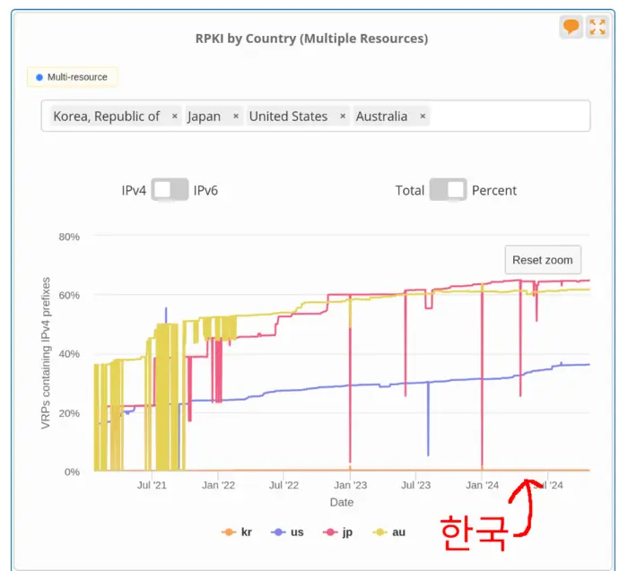

# 한국 인터넷 BGP 네트워크 RPKI 적용률 트래커
- 나무위키 [2021년 10월 KT 인터넷 장애 사건](https://namu.wiki/w/2021%EB%85%84%2010%EC%9B%94%20KT%20%EC%9D%B8%ED%84%B0%EB%84%B7%20%EC%9E%A5%EC%95%A0%20%EC%82%AC%EA%B1%B4)
- MTN 뉴스 [세계 표준되는 RPKI…우리나란 예산 '0원'](https://news.mtn.co.kr/news-detail/2024090813332917792)
- KISA [라우팅 인증(RPKI)](https://한국인터넷정보센터.한국/jsp/resources/rpki.jsp)

<a href="https://youtu.be/WGY_d4XFcjo">
MBC 보도: KT 인터넷 서비스 장애 "상황 파악중"


</a>




https://stat.ripe.net/ui2013/widget/rpki-by-country#w.resource=kr%2Cus%2Cjp%2Cau

RPKI가 BGP 설정 오류로 인한 장애 예방에 좋으면 빨리 적용해야겠죠? 각 사업자의
RPKI 적용률을 여기서 확인하세요.

UTC 기준 매주 월요일 자정에 업데이트 자동 업데이트 중([Github
Actions](https://github.com/dxdxdt/rpki-tracker-kr/actions)). 데이터는
`master`에 자동으로 커밋됨. 개발 편의를 위해 `dev`와 `stable` 브랜치에서는
데이터 파일이 트래킹되지 않음. 소스코드 수정은 해당 브랜치에서 진행, CD/CI에
적용 필요 시 `master`와 머지.

## 스크립트 실행 절차
[Makefile 레시피](Makefile) 설명.

1. KISA [AS번호 사용자
   현황](https://krnic.kisa.or.kr/jsp/business/management/asList.jsp) 페이지
   로드, 테이블 파싱
1. 파싱한 AS번호들 이용하여 [whois.radb.net](https://radb.net) 쿼리하여 라우팅 프리픽스
   정보 받아오기
1. 받아온 라우팅 프리픽스를 radb에 쿼리하여 `rpki-ov-state` 값이 `valid`인
   프리픽스만 추려냄
1. 데이터 취합 후 markdown테이블과 csv 파일 생성
1. READMD.md 생성, 테이블 삽입

## 프리픽스 현황
https://krnic.kisa.or.kr/jsp/business/management/asList.jsp

| 범례 | 설명 |
| - | - |
| ASN | 자율시스템 번호 |
| Name | 자율시스템 운영사 |
| RPKI | 유효한 ROA가 적용된 라우팅 프리픽스 개수 |
| Total | 총 라우팅 프리픽스 개수 |
| % | RPKI/Total 백분율 |
| Bars | 20점 만점 점수 |

AS는 [여러
종류](https://en.wikipedia.org/wiki/Autonomous_system_(Internet)#Types)가
있지만, [DFZ](https://en.wikipedia.org/wiki/Default-free_zone) 라우터에서 직접
네트워크 구조를 분석하지 않는 이상, RADB의 정보만으로는 어떤 AS가 ISP와 IX인지,
어떤 AS가 stub인지 알 수 없음. 이를 할 때 필요한 [LG
서버](https://en.wikipedia.org/wiki/Looking_Glass_server)가 한국에 많이 존재하지
않음. 하지만 인터넷 마비 예방은 ISP와 IX에서 운영되는 라우터에만 적용되어도
충분히 예방될 수 있음. 단순 CDN 애니케스트나, CPE, 데이터센터인 stub AS에서 RPKI
validation을 할 필요가 없기 때문에, 보급률이 100%가 될 필요는 없음. 이는 RIPE
지역의 보급률이 80%인 사실로 확인할 수 있음.

주의깊게 봐야할 AS들은 한국 기간망을 운영하는 통신 3사와 국내 IX임.

**업데이트: %LAST_UPDATE_ISOTIME%**

### IPv4
%THE_TABLE_V4%

### IPv6
%THE_TABLE_V6%

## Usage
### INSTALL
```sh
dnf install curl netcat make python3
git clone https://github.com/dxdxdt/rpki-tracker-kr
```

### Generate
실행 시간 5분 내외. 메모리 사용량(RSS): 약 50MB

```sh
make clean
make
```

<!--
## Director's Commentary
> [They're bashing they're bashing hard right now.](https://www.youtube.com/clip/Ugkxcic7nqMOsjDFaM1mGLm0f2_Kd82YeJbe)
-->
